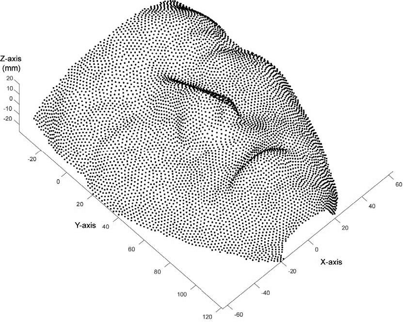

# Android 爛裝置想跑人臉辨識0 – 到底有多爛？

> 原文網址：https://boochlin.com/?p=401
> 發布日期：2025-02-15
> 文章編號：401

---




## 爛裝置是什麼？

這次的主角是：**Qualcomm Snapdragon QM215**，搭配 **2GB RAM**，架構為 **ARMv8-A**。

這顆 SoC 是高通在 **2019 年發售**的超入門處理器，設計初衷就是給低價 Android 手機或 IoT 設備使用。雖然它支援 64bit 架構、雙鏡頭、功耗低，
但同時也有幾個硬傷：

* 沒有 NPU，AI 要靠 CPU/GPU 硬扛

* RAM 上限 3GB，實際只裝了 2GB（為了省錢）

* 四核心 Cortex-A53，最高只有 1.3GHz

你是公司請來的技術負責人，2024 年收到這顆晶片，要在它上面做臉部辨識。你不能翻桌，也不能罵老闆，因為創業公司改硬體是禁忌，只能想辦法把爛機救活。

---

## 應用場景

任務需求不是簡單的開個鏡頭而已，而是：

> 

**臉部辨識設備，通過 BCTC 增強級認證（金融等級）**

要求包含：

* **辨識時間 < 1 秒**

* **辨識精度 99.99%**

* **活體安全認證（增強級）**

---

## 系統環境與初步評估

### 作業系統：Android 10

雖然 QM215 官方只提供 Android 9 的 BSP，但我們選擇升級到 Android 10，目的是希望減少非預期錯誤。代價是：Android 9~10 的系統服務預設就非常肥，**光是開機就吃掉了 1.3GB RAM**。

### 鏡頭需求：RGB + TOF 雙鏡頭串流

* **TOF（Time of Flight）是活體辨識的關鍵**

* 我們採用的是 **iToF（間接飛行時間）實作**

* 雙鏡頭串流 + Frame buffer 處理，經測試約佔 **950MB 記憶體**

### AI Model 推論架構

完整臉部辨識流程包含：

```
Face Detect → Face Align → Liveness Detection → Image Quality Check
→ Feature Extraction → Feature Matching
```

其中 Image Quality Check 又細分為：

* head_pose_model

* expression_model

* blurriness_model

* occlusion_model

* cv_over_exposure

這些模組大多用 TensorFlow Lite / NCNN 實作，也有些用影像處理簡化掉，但仍然要吃掉 **約 300MB 記憶體**。

---

## 問題馬上浮現

> 

**鏡頭 950 MB + AI 模型 300 MB + System 1300 MB = 3180 MB > 2000 MB**

RAM 直接炸裂。

> 

**CPU 幾乎長期 90% 滿載**（A53 x4 核心）

AI 推論 + 影像處理壓力極大。

> 

**目前推論 + 鏡頭總處理時間 = 1.5 秒**

距離 <1 秒有點距離。

---

## 我們的方向

* **記憶體節省是第一要務**

* **運算速度優化必須同步進行**

因為我們有修改 AOSP 的權限，第一步可以從砍掉沒用的 system service 開始。

但在那之前，請記得：

> 

飛機起飛前，先裝好儀表板。

沒有記憶體使用監控、沒有效能監控工具，一切都是瞎忙。

## 

QM215是一款高通於 2019年發售的低效能CPU，主要針對低價智慧型手機和物聯網設備，優點是功耗較低，支援雙鏡頭，為 64bit 架構，但缺點是最多只支援 ３GB ram，甚至為了省錢，老闆只願意裝2GB，此外 QM215 沒有NPU 但具有 GPU and CPU(1.3G)

以上是你身爲技術負責人於２０２４年拿到的一個裝置，要想想這是一個4年前發售的入門級處理器，但是身為專業的你不能馬上開始找老闆算帳，畢竟公司找你來是解決問題，而在新創公司，要花錢改硬體通常是老闆最不願意做的事情。重點是不管是啥爛裝置，只要應用的情況適當，就是可以用

**應用場景-人臉辨識裝置且能通過 BCTC 增強級認證（辨識時間<1秒，辨識精度高達99.99%，活體安全認證（增強級），達到金融級支付標準）**

**Android 10 **– 主要是因為 QM215 官方只針對 android 9 提供BSP，為了降低可能出現的非預期情況，然而代價就是 android 9 system service 跑起來就會消耗 1.3 GB memory used

雙鏡頭 RGB and TOF Streaming – 人臉辨識只靠單個 RGB 鏡頭是無法達到活體辨識 Liveness Check，所以必須利用TOF（Time of Flight），這部分有好幾種實作方式，但我們是採用IR，這部分我們等同於需要同時處理兩個鏡頭的資料流，這意味者 cpu 運算資源跟 memory 都會高速消耗．這部分經過測試約使用950mb

人臉辨識 AI Model – 在大部分的情況下，就算針對 EDGE device 去優化模型，也只是相對大型server上的差異，沒辦法真的壓到很低的運算資源去跑，經過多方評估採用 tensorflow lite, ncnn （想當年還用 caffe2），加上一個完整的人臉識別流程，並非一個單一模型就可以完成，以下是最基本的流程

**Face Detect → Face Align → Liveness Detection → Image Quality Check（head_pose_model**，expression_model，blurriness_model，occlusion_model，cv_over_exposure**） → Feature Extraction → Feature Matching**.

可能並非每個都需要ai infer，有些使用傳統影像處理方始就很夠了，但綜合評估下來約化使用 300 MB 的記憶體，以及大量的 CPU 運算資源

背景交代完畢了，接下我們馬上就發現

memory爆炸 -> 鏡頭 950 mb + ai model 300 mb + system 1300 mb > 2000 mb RAM

CPU 負荷幾乎隨時都在 90%，主要來自於 AI 推理與影像處理（4x Cortex-A53 全核心幾乎都滿載）。，目前整個人臉辨識流程（包含影像處理 + AI 推理）約需 1.5s。

節省記憶體＋優化計算速度變成我們的第一項工作，針對記憶體可以先從系統下手，畢竟我們擁有整個 AOSP 的修改權利，但在這之前可能大家需要先知道怎麼評估記憶體使用，畢竟沒有儀表板的飛機，沒人敢開，沒有評估機制，怎知道成效好壞

```

```

---

###
