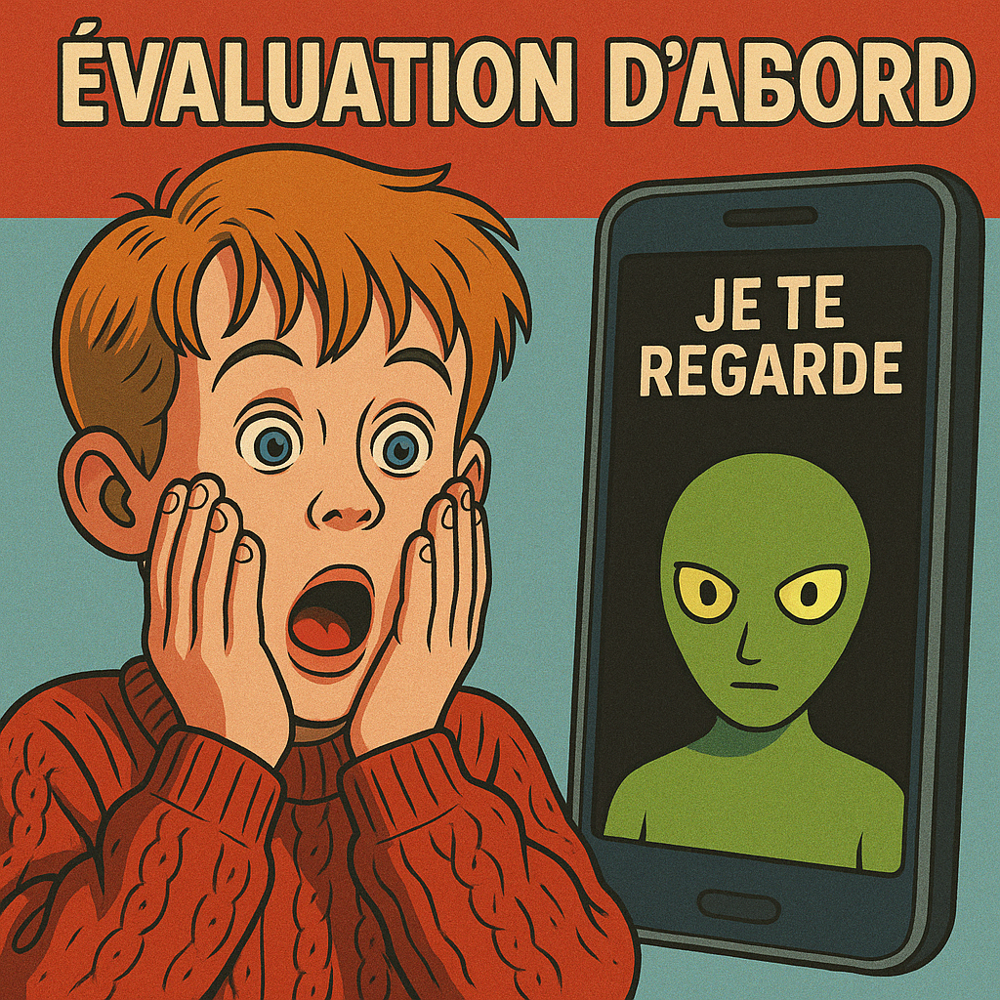
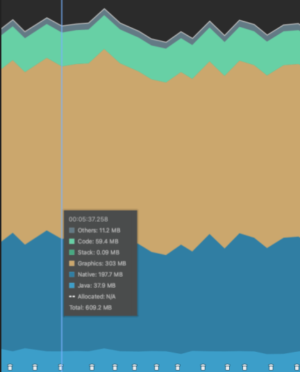

# Android 爛裝置想跑人臉辨識1 – 評估第一

> 原文網址：https://boochlin.com/?p=461
> 發布日期：2025-02-20
> 文章編號：461

---



上一篇把高通 QM215 這塊破板子的底牌掀了：4 顆 1.3GHz 的弱雞 A53、沒有 NPU、為了省錢只焊了區區 2GB RAM。

很多工程師一拿到這種硬體，熱血上頭立刻打開 IDE，開始上網找各種「極速神經網路加速」、「高併發多執行緒」黑魔法，恨不得第一天就重構整個演算法。

聽我一句勸：先把你的鍵盤收起來。

我們做的是 7x24 小時掛在牆上的專用人臉辨識終端，不是休閒手機。它開機就只有一個使命：雙鏡頭影像流要進來、AI 模型要跑、人臉要在 1 秒內認出來，而且絕對不准當機。

但在你動手寫任何一行優化代碼之前，先看看這個殘酷的算術現實：

> 2048MB (實體 RAM) - 1300MB (Android 開機常駐) - 950MB (RGB + ToF 雙流) = -202MB < 0

連 AI 模型的權重都還沒載入，帳面上就已經倒貼 200MB。這意味著你的 App 只要敢呼吸一口空氣，Android 內核的 LMKD 就會提著大刀在背景四處巡邏，隨時準備把你的進程當場處決。

在這種極限生存戰場上，**沒有儀表板的飛機沒人敢開；不懂量測的優化不叫技術，叫作法抽籤。**

你如果不清楚每一塊記憶體被誰吃掉，做再多所謂的優化，最後都只是在瞎忙。

---

## 第一步：全機死活宏觀盤點（dumpsys meminfo）

設備接上 USB，開機進系統，你第一個該執行的指令絕對不是打開 Android Studio Profiler 去看那條花花綠綠的曲線，而是站在 Linux 核心視角問一句：**整台機器到底還剩多少口氣可以活？**

直接在終端機敲下：

```bash
adb shell dumpsys meminfo
```

輸出最上面那一段，就是整台設備的生死判決書：

```text
Total RAM: 1,909,104K (status normal)
Free RAM:   456,339K (  140,995K cached pss +   251,112K cached kernel +    64,232K free)
Used RAM: 1,503,496K (1,301,496K used pss +   202,000K kernel)
Lost RAM:   125,250K
    ZRAM:    44,240K physical used for   225,168K in swap (  524,284K total swap)
     KSM:    26,640K saved from shared       828K              20,964K unshared;     6,096K
```

這堆數字不是天書，請用放大鏡仔細看清楚：

* **Total RAM（1.9GB）**：規格書上寫 2GB，扣除開機前被基頻、Modem 和 Bootloader 硬生生切走的保留區，你能支配的極限就只有 1.9GB。
* **Free RAM（真正能用的只有 64MB）**：很多菜鳥看到 Free 還有 456MB 就安心了，那是被騙了！裡面有 140MB 是 cached pss、251MB 是核心快取，真正的「絕對自由空間（free）」只有可憐的 64MB。只要系統稍微切換一下 context，這點自由空間瞬間蒸發。
* **Used RAM（1.5GB）**：開機什麼都沒跑，系統就已經吞噬了 1.5GB，整台機器幾乎已經滿到喉嚨。
* **ZRAM**：用 44MB 壓縮出 225MB 的 swap 空間。壓縮比超過 5 倍，這是低階晶片唯一的遮羞布。
* **Lost RAM（125MB）**：這是硬體驅動、ION 記憶體分配、GPU 共享記憶體吃走後的黑洞，永遠要不回來。

記住這個鐵律：**如果你開完機看到 Free RAM 小於 100MB，AI 模型載入瞬間 OOM 就是必然的物理規律。**

每次你裁減了系統服務、改了底層配置，開機後第一件事就是跑這條指令驗收成果。

---

## 第二步：精算 App 記憶體骨架（不要只看總量）

知道全機現況後，接下來把槍口對準我們自己的應用程式：

```bash
adb shell dumpsys meminfo com.edge.ai.facegate
```

你拿到的輸出結構長這樣：

```text
Applications Memory Usage (in Kilobytes):
** MEMINFO in pid 12345 [com.edge.ai.facegate] **
                   Pss  Private  Private  Swapped     Heap     Heap     Heap
                 Total    Dirty    Clean    Dirty     Size    Alloc     Free
                ------   ------   ------   ------   ------   ------   ------
  Native Heap    43264    41800        0        0    49152    45000     8000
  Dalvik Heap    92160    90500        0        0   102400    98000     4300
 Dalvik Other    10240    10000        0        0
        Stack     2048     2048        0        0
       Ashmem     3072     3072        0        0
     .so mmap    15360     1024     8192        0
    .apk mmap     2048        0     2048        0
    .dex mmap     8192        0     8192        0
      GL mtrack   4096     4096        0        0
       Unknown    20480    20480        0        0

         TOTAL   205600   192096    20408        0

 App Summary
                       Pss(KB)
            Java Heap:    90500
          Native Heap:    41800
                 Code:    21504
                Stack:     2048
             Graphics:     6144
        Private Other:    30496
               System:    12308

           TOTAL PSS:   205600       TOTAL RSS:   194560
```

看這個報表，不要只看最後一行 TOTAL PSS，必須死盯著三個關鍵維度：

1. **Native Heap (Private Dirty 約 41MB)**：
   C/C++ 底層緩衝區、OpenCV Mat、點雲座標結構與 AI 權重都在這裡。
   `Private Dirty` 是排查 Native 洩漏的唯一生化指標——只要鏡頭開著、辨識在跑，這個數字如果一路往上爬不回頭，代表你底層的 C++ 肯定有 `malloc` 或 JNI byte 陣列忘記釋放。
2. **Dalvik Heap (Private Dirty 約 88MB)**：
   Java 物件空間。如果它持續逼近 Heap Size 上限，ART 虛擬機就會開始瘋狂發動 GC，接下來就是 CPU 飆高、幀率斷崖式下跌，最後送你一個經典的 OOM。
3. **TOTAL PSS (約 200MB)**：
   PSS（Proportional Set Size）是把進程共享的記憶體依比例均攤後的真實物理佔用。這個數字才是 LMKD 決定要不要殺你的依據。

---

## 第三步：Android Studio Profiler——給老闆看趨勢用的工具

Android Studio Profiler 很酷炫，有彩色曲線圖、有時間軸，非常適合在週會上投影出來向老闆證明「這套系統真的快被記憶體撐死了」。



但在硬核排障時，它真正有用的只有兩招：

* **Heap Dump**：在特定時機抓下當前記憶體的快照（.hprof）。我用這招抓出過無數次災難——絕大多數都是 `byte[]` 和 `ByteBuffer` 在搞鬼。相機 Callback 每秒送來 30 張 YUV 影格，只要前處理流程手賤每次都 `new byte[]`，幾秒鐘就能把 Java Heap 堆成垃圾山。
* **Allocation Tracker**：即時觀察是哪一行代碼在瘋狂配置記憶體。如果看到影像處理迴圈裡每幀都在重新建立 OpenCV 的 `Mat`，那就找到了讓 GC 抓狂的罪魁禍首。

---

## 第四步：smaps 顯微鏡——揪出 Native 與 GPU 偷吃幽靈

如果你碰到最詭異的狀況：**Profiler 顯示 Java Heap 很健康，dumpsys 裡的 Native Heap 也沒超標，但整台設備的 Free RAM 卻像中邪一樣每秒少 5MB，最後直接被 LMKD 擊斃。**

這時候你面對的就是最隱蔽的「堆外記憶體幽靈」。你必須動用 Linux 核心終極武器：

```bash
adb shell cat /proc/$(pidof com.edge.ai.facegate)/smaps
```

每一段 VMA（虛擬記憶體區間）都會吐出像這樣的微觀數據：

```text
7f3e0000-7f3f0000 rw-p 00000000 00:00 0
Size:               64 kB      # 該記憶體區塊虛擬大小
Rss:                60 kB      # 實際佔用的實體記憶體
Pss:                30 kB      # 共享加權後的實體佔用
Shared_Dirty:        0 kB
Private_Dirty:      60 kB      # 專屬該進程且有寫入的私有記憶體（洩漏元兇）
Referenced:         60 kB      # 最近被存取過的活動頁面
Anonymous:          60 kB      # 匿名記憶體（malloc / mmap 申請的無檔案緩衝區）
VmFlags: rd wr mr mw me ac
```

透過 smaps 交叉比對，你可以立刻抓出低階 Android 終端最常發生的三大血案：

1. **相機 Buffer 洩漏**：`Anonymous` 區塊瘋狂暴衝，但在 Java Profiler 裡完全隱形，這通常是相機底層 HAL 或 BufferQueue 的環形隊列卡死。
2. **模型 Pre-load 浪費**：`.so`、`.apk`、`.dex` 段常駐了幾十 MB，一查才發現裡面塞了早就沒在用的廢棄演算法模型。
3. **ION / GPU 偷吃**：如果 smaps 裡有一大塊記憶體被標記為驅動映射，但你的演算法明明沒在跑，那就是相機 ISP 或 GPU 驅動沒有把 FrameBuffer 歸還給系統。

如果覺得原生 smaps 太龐大很難肉眼解析，業界有開源的記憶體分析腳本（例如高見龍的 Android-App-Memory-Analysis），能直接幫你按進程彙整 smaps：
https://github.com/Gracker/Android-App-Memory-Analysis

---

## 結語：優化前的靈魂拷問

把這套評估工具鏈跑過一輪之後，你手頭上必須能精確回答這四個核心問題：

* 到底是 Java 堆積、Native 堆積，還是 Graphics 顯存佔用最大？
* 記憶體是不斷線性上升（洩漏），還是波浪狀反覆震盪（頻繁配置與 GC）？
* 每一幀影像進來，到底有沒有額外產生無效的垃圾物件？
* 當前 Free RAM 的距離，離 LMKD 的紅線還有多少 MB 安全裕度？

搞清楚帳單上的每一筆開銷，我們下一篇就可以正式拿起手術刀，從肥大的 AOSP 系統服務開始大刀闊斧剃骨抽脂。

**記住：不懂量測的優化叫作法，有數據的下刀才叫工程。**

---

### 參考資料 (References)
1. Android 官方記憶體管理指南: https://developer.android.com/topic/performance/memory
2. AOSP MemInfoDumpTruck 源碼實作: https://android.googlesource.com/platform/frameworks/base/+/master/services/core/java/com/android/server/am/MemInfoDumpTruck.java
3. Linux ION Memory Allocator 機制: https://elinux.org/Android_ION
