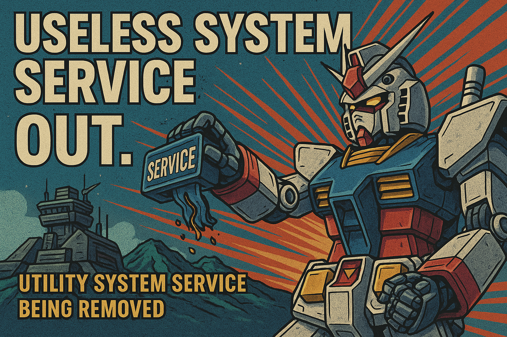

# Android 爛裝置想跑人臉辨識2 – 記憶體優化：無用系統服務徹底剔除

> 原文網址：https://boochlin.com/?p=416
> 發布日期：2025-03-21
> 文章編號：416

---



上一篇把 dumpsys、procrank 與 smaps 的儀表板架好後，所有人都看傻了眼：高通原生 Android 10 BSP 剛編譯出來，什麼 App 都沒裝，開機常駐就直接啃掉 1,300MB RAM。

在總共只有 2GB（扣除基頻與硬體保留區後實體只剩 1.9GB）的破板子上，小學算式是殘酷且毫不留情的：

> 1900MB (可用總量) - 1300MB (原生系統常駐) = 600MB
> 600MB (剩餘空間) - 950MB (RGB + ToF 雙相機串流) = -350MB < 0

連 AI 模型的權重都還沒從 Flash 讀進記憶體，系統就已經直接倒貼 350MB。這代表你的主程式只要一打開相機，LMKD 就會在背景提著大刀把你的進程當場處決。

很多人一看到系統吃記憶體，熱血上頭就想打開 Java 源碼亂砍。

聽我一句勸：瘦身不能無腦拿鋸子亂鋸。我們做的是 7x24 小時鎖死在牆上的專用門禁機，不是休閒手機。它不需要音樂播放器、不需要撥打電話、不需要虛擬鍵盤、更沒有鋰電池。

我們分兩階段動刀：先走 Google 原廠 AOSP 標準規範，再依門禁機物理特性極限抽脂。

---

## 第一階段：AOSP 工業界標準規範（零侵入瘦身）

很多嵌入式新手不知道，Google 和高通對於 1GB ~ 2GB 的低記憶體設備早就留好了標準後門。一行 Java 源碼都不用改，全在 Makefile 與 XML 宣告裡：

### 1. 繼承 Google go_defaults.mk（Android Go 模式）

在產品的 `device.mk` 開頭直接引入：

```makefile
# 引入 Android Go 輕量化系統配置
$(call inherit-product, build/make/target/product/go_defaults.mk)
```

這一行 macro 會在編譯期全域注入 `ro.config.low_ram=true`。

底層會連鎖觸發一系列神經反射：強制關閉多視窗分屏、停用動態桌布與複雜視窗陰影、限制 ActivityManager 的背景快取進程上限從 32 個腰斬到 3 個，ActivityStack 深度降到最低。光是這一行，系統就冷靜了三分之一。

### 2. 在 BoardConfig.mk 宣告 TARGET_NO_TELEPHONY

門禁機鎖在牆上接乙太網或 WiFi，板子上連 SIM 卡槽都沒有，幹嘛在背景跑完整的電話協定棧？

在 `BoardConfig.mk` 內宣告：

```makefile
TARGET_NO_TELEPHONY := true   # 徹底拔除 RIL 通訊守護行程與撥號模組
TARGET_NO_RADIO := true       # 關閉行動網路射頻管理
BOARD_HAVE_BLUETOOTH := true  # 藍牙必須保留（BLE 近場配網維護專用）
```

這樣編譯系統就不會把 `rild`、`telephony-common.jar` 與基頻監控 Daemon 包進 system.img，開機省下 40MB 的常駐 PSS。

### 3. 移除 permissions/*.xml（讓 SystemServer 自然跳過）

這是 AOSP 最優雅的瘦身手段。

`SystemServer.java` 在開機啟動幾十個系統服務時，每一步都會先去問 PackageManager：`pm.hasSystemFeature(...)`。如果系統找不到對應的 feature 宣告，該服務連實體都不會 new 出來，直接從記憶體蒸發。

做法非常簡單：在 `device.mk` 裡面，不要把這些 XML 複製到 `/system/etc/permissions/`：

* 移除 `android.hardware.nfc.xml`：NfcService 直接不啟動（省 18MB）。
* 移除 `android.software.print.xml`：PrintManager 連影子都沒有，門禁機誰跟你印文件（省 12MB）。
* 移除 `android.hardware.telephony.xml`：TelephonyRegistry 徹底閉嘴（省 25MB）。
* 移除 `android.hardware.location.gps.xml`：LocationManager 忽略 GPS 輪詢（省 15MB）。

這一步完全合規、零侵入，沒有任何副作用，開機現省 70MB。

---

## 第二階段：專用終端極限 Kiosk 抽脂（再榨 220MB）

走完第一階段標準規範，系統常駐成功從 1,300MB 降到 1,000MB。但距離 950MB 雙相機串流的安全線，空間依然吃緊。

接下來針對「固定在牆上、接 12V 變壓器、單一全螢幕 App」的物理特性，進行外科手術級別的精準抽脂：

### 1. 幹掉 SystemUI 與 Launcher3（直接省下 80MB ~ 120MB）

這是一般 Android 手機不敢動、但專用硬體必須下狠手的地方。

系統預設開機會把 Launcher3（桌面）與 SystemUI（狀態列、導航列、下拉選單）常駐在 RAM 裡。對人臉辨識終端來說，這兩個東西純粹是浪費資源的裝飾品。

* **直接以 App 為桌面**：在人臉辨識主程式的 `AndroidManifest.xml` 中宣告為 `HOME`：

```xml
<activity android:name=".MainActivity" android:launchMode="singleTask">
    <intent-filter>
        <action android:name="android.intent.action.MAIN" />
        <category android:name="android.intent.category.HOME" />
        <category android:name="android.intent.category.DEFAULT" />
    </intent-filter>
</activity>
```

開機 Zygote 直接拉起主程式，編譯時從 `PRODUCT_PACKAGES` 徹底拔除 `Launcher3QuickStep`，省下 45MB。

* **關閉 Keyguard 鎖屏**：在 `frameworks/base/core/res/res/values/config.xml` 修改：

```xml
<bool name="config_enableLockScreen">false</bool>
```

鎖屏模組直接不初始化，再省 15MB，且徹底杜絕偶發跳回鎖屏介面的靈異現象。

### 2. 拔除 LatinIME 虛擬鍵盤（省下 25MB ~ 35MB）

門禁機如果需要輸入管理員密碼或 PIN 碼，主程式自己用 OpenGL 或自繪 View 處理。

從 `PRODUCT_PACKAGES` 拔掉 `LatinIME`，並在 `config.xml` 關閉預設輸入法檢查：

```xml
<bool name="config_showDefaultIME">false</bool>
```

不用載入字典庫、不用維持輸入法服務進程，開機又清爽了 30MB。

### 3. 拔除電池監控（省下 15MB 與 CPU 輪詢）

門禁機接的是 12V 工業電源或 PoE 供電，板子上根本沒有鋰電池。

但原生 Android 預設會一直監控電池健康度，`PowerUI` 會定時跳通知、彈警告、維護 battery status log。

直接在 `build.prop` 設定：

```properties
ro.boot.charger=0
```

並在 frameworks 中關閉低電量彈窗，省下背景執行緒無謂的輪詢與日誌寫入。

### 4. 禁用 Zygote 預載 WebView（省下 30MB ~ 50MB）

我們的人臉辨識、3D 點雲繪製全走 C++ Native 與 OpenGL ES 渲染，整台機器連半個網頁都不會開。

原生 Zygote 為了加速未來的網頁載入，開機時會在 `ZygoteInit.java` 裡面呼叫 `WebViewFactory.prepareWebViewInZygote()`，把肥碩的 Chromium 內核載進記憶體。

直接在 Framework 底層修改，跳過這段預載。每一個從 Zygote fork 出來的進程瞬間輕量化，實體 RAM 直接省下 40MB。

### 5. 裁剪無用音訊 Codec 與特效（省下 20MB）

清空 `/vendor/etc/media_codecs.xml` 裡那些花俏的 Dolby、DTS、4K 硬解外掛。

門禁機只需要播放「辨識成功」的短促 PCM 嗶聲或語音播報（TTS），停用 `audioserver` 裡複雜的環繞音效與多聲道處理器，只保留基本音頻通道。

### 6. 鎖死單用戶與螢幕方向（省下 15MB）

門禁機是壁掛的，這輩子都不會旋轉螢幕。

在 `build.prop` 寫入：

```properties
fw.max_users=1
persist.sys.app.rotation=force_land
```

限制系統永遠為單一用戶，並強制鎖定方向（橫屏或豎屏），直接關閉 SensorService 對陀螺儀與重力感測器的定時輪詢。

---

## 理智的底線：哪些命根子絕對不能動？

瘦身一定要有底線，剪錯線會直接翻車。以下幾樣東西就算再佔空間，也絕對不准拔：

1. **BLE 藍牙協定棧（GATT Server）**：這是現場施工人員免拆機、免拉線，直接用手機配網與除錯的生命線。
2. **網路通訊守護（netmgrd / netd）**：特徵庫離線同步、MQTT 與 WebSocket 即時通訊必須依賴它。
3. **高通溫控守護（thermal-engine）**：門禁機大多裝在戶外或通風不良的密閉金屬殼內。夏天高溫下如果沒有溫控降頻保護，晶片會直接過熱燒死。
4. **surfaceflinger / inputflinger**：相機預覽管線與觸控事件的核心基石。

---

## 戰果驗收：小學算術打臉時間

這是一套經過實機驗證的記憶體瘦身帳單：

* **原生高通 Android 10 BSP**：開機常駐 1,300 MB
* **第一階段（Android Go + 拔通話 + 系統特性裁減）**：降至 1,000 MB（奪回 300 MB）
* **第二階段（Kiosk 極限裁減：Launcher3 / IME / 電池 / WebView）**：再降至 780 MB（奪回 220 MB）
* **最終系統常駐淨消耗**：**780 MB**（整整省下 520 MB 實體空間！）

現在我們把數字重新代回一開始的生死等式：

> 1900MB (可用總量) - 780MB (瘦身後系統) = 1120MB
> 1120MB (剩餘空間) - 950MB (RGB + ToF 雙相機串流) = +170MB > 0

帳面上終於出現了寶貴的正數！這多出來的 170MB，加上 ZRAM 壓縮換出的空間，正好讓 300MB 的人臉辨識引擎與特徵庫能夠大口呼吸。

---

## 結語與防坑心法

做嵌入式 Android 系統優化，最忌諱的就是盲目改代碼。

1. **先走體制內標準**：善用 `go_defaults.mk`、`TARGET_NO_TELEPHONY` 與 permissions XML，90% 的贅肉在編譯期就能優雅剃除。
2. **再依場景精準下刀**：搞清楚你的硬體本質是門禁機，無桌面、無鍵盤、無電池、無網頁，把不該存在的包袱全丟掉。

**把系統壓到只剩骨頭，AI 才能在上面長出肌肉。**

下一篇，我們把手術刀切向 Linux 核心：ZRAM、SWAP 與 KSM，看看在不能換硬體的死局下，如何用內核配置把記憶體壓榨到最後一滴。

---

## 參考資料 (References)

1. **Android Go Edition Device Configuration**: Google 官方低記憶體設備配置規範.
https://source.android.com/docs/core/perf/low-ram

2. **AOSP System Features & Permissions**: Managing system features via permission XML declarations.
https://source.android.com/docs/core/permissions/perms-features

3. **Android Enterprise Dedicated Device (Kiosk Mode)**: Single-app device deployment guidelines.
https://developer.android.com/work/dpm/dedicated-devices
