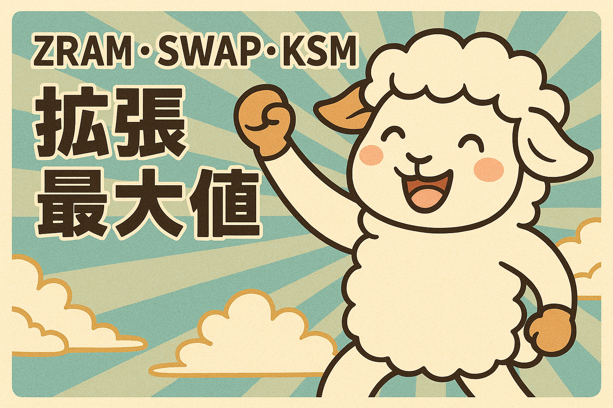

# Android 爛裝置想跑人臉辨識3 – 系統優化：ZRAM, SWAP, KSM 擴張最大值

> 原文網址：https://boochlin.com/?p=418
> 發布日期：2025-03-25
> 文章編號：418

---



上一篇我們大刀闊斧，把 Android 系統服務從 1,300MB 一路砍到 780MB，奪回了 520MB 的實體空間。

但只要算盤一撥，現場依然令人窒息：

> 1900MB (可用實體 RAM) - 780MB (剪裁後系統) - 950MB (RGB + ToF 雙流) = 170MB

剩餘的 170MB 看似擺脫了負數，但只要人臉辨識演算法載入 50MB 權重、分配特徵比對庫、再加上幾百個人臉緩衝區，記憶體水位瞬間又被推到懸崖邊緣。稍微來個多執行緒晃動，LMKD 隨時又會衝出來斬殺你的 App。

硬體就焊死在那裡，老闆不可能幫你加 RAM。

在 Linux 核心的世界裡，自古流傳著三大「記憶體擴張黑魔法」：**KSM（記憶體合併）**、**傳統 SWAP（硬碟交換）**、以及 **ZRAM（記憶體壓縮交換）**。

很多人以為這三招隨便開一個就能救命。

聽我一句勸：在 4 核心弱 CPU 的低階硬體上，亂開核心功能不叫優化，叫慢性自殺。

這篇就來聊聊我們在 2GB 破板子上，如何踩平這些內核深坑，找到生死交界的極致平衡點。

---

## 0. 硬核前置知識：為什麼 DMA / ION 緩衝區碰都不能碰？

在動任何 Linux 核心參數之前，必須先建立一個鐵一般的物理認知：

很多工程師以為開了 ZRAM 或 SWAP，相機影像和 AI 模型的記憶體就能跟著被壓縮。**在 Linux 核心底層，這純粹是白日夢。**

* **DMA / ION 的物理本質**：相機 ISP 吐出的 YUV 畫面、ToF 感測器輸出的 RAW12 深度圖，以及 GPU/NPU 推理所存取的張量緩衝區，全部都是透過 **ION / DMA-BUF** 機制向系統申請的連續實體頁面。
* **驅動層釘死（Pinned Pages）**：這些緩衝區為了讓硬體晶片（ISP、GPU、DSP）以最高頻寬直接透過 DMA 存取，由驅動層直接鎖死在實體記憶體中，標記為不可移動、不可分頁的 Non-LRU 頁面。
* **核心無法壓縮**：Linux 核心的 Swap/ZRAM 機制**只能作用於用戶空間的匿名頁面（Anonymous Pages）**。核心根本沒有任何能力、也不可能把硬體驅動釘死的 DMA-BUF 搬去壓縮。

這代表了一個極度殘酷的現實：**雙相機與 AI 推理佔用的 950MB 實體 RAM 是物理硬成本，雷打不動。**

我們能壓榨的對象，永遠只有旁邊那些討人厭的**「Android 系統背景服務匿名頁面」**。我們的核心戰略，是用最微小的 CPU 代價，把系統服務的冷資料壓縮打包，把寶貴純淨的實體 RAM 騰給 30fps 人臉辨識戰場。

---

## 1. Kernel Samepage Merging（KSM）——看似美好的賠本毒藥

KSM 的原理聽起來無懈可擊：核心背景有個守護進程叫 `ksmd`，定期掃描系統記憶體。只要發現有兩個 4KB 頁面的內容完全一模一樣，就把它們合併成同一個實體頁面，並標記為 Copy-on-Write（寫入時複製），憑空生出免費記憶體。

聽起來很神對吧？我們在 QM215 上實測的結果只有四個字：**血本無歸**。

* **記憶體省了個寂寞**：KSM 在背景掃描了半天，全機總共只省下了不到 **20MB**（佔比不足 1%）。因為相機緩衝區不能碰、AI 模型不能碰，系統服務裡真正完全相同的匿名頁面少得可憐。
* **CPU 算力被嚴重偷吃**：`ksmd` 為了不斷比對記憶體頁面的 Hash，在我們那 4 顆弱雞 1.3GHz A53 核心上，硬生生吃掉了 **8% ~ 10% 的 CPU 使用率**！

算式擺在眼前：

> 消耗：10% CPU 寶貴算力
> 收益：省下 20MB 記憶體
> 結論：賠本生意，人臉辨識幀率直接從 30fps 掉到 24fps

**工程決策：果斷關閉 KSM。內核編譯時直接拿掉，連一行背景掃描代碼都不准跑。**

---

## 2. 傳統 Swap（eMMC / Flash）——工控終端的自毀定時炸彈

當 RAM 不足時，傳統 Linux 伺服器最常做的事就是切一塊硬碟分區當 Swap，記憶體不夠就往硬碟倒。

但在 7x24 小時無人看管的壁掛門禁機上，**絕對嚴禁使用板載 eMMC / Flash 當作 Swap**：

* **Flash 壽命被迅速磨穿（TBW 限制）**：板載 eMMC 顆粒的擦寫次數（P/E Cycles）是極其有限的。門禁機全天候運作，頻繁的 Swap 寫入會在幾個月內將 eMMC 顆粒特定區塊寫爛，整台機器當場變磚開不了機。
* **災難級的 I/O 延遲**：eMMC 的隨機讀寫延遲動輒幾十毫秒（ms），而 RAM 是奈秒（ns）級。一旦相機或演算法執行緒踩到 eMMC Swap-in 缺頁異常，畫面瞬間卡死定格，相機管線直接暴斃掉幀。

**工程決策：Android 原廠從不啟用 Flash Swap 是完全正確的，千萬別自己自作聰明去掛載 eMMC Swap。**

---

## 3. ZRAM（記憶體壓縮）——弱 CPU 設備上的「克制藝術」

排除掉兩條死路，唯一能在這台破板子上活命的，就只有 **ZRAM（記憶體壓縮交換）**。

ZRAM 的概念極度優雅：它在 RAM 內部劃出一塊虛擬區塊，當記憶體告急時，核心把系統較少存取的冷資料透過 CPU 快速壓縮後塞進這塊區域。需要用時再解壓縮還原，完全不經過慢速的 eMMC。

但在弱 CPU 設備上玩 ZRAM，必須有極度冷靜的**「克制思維」**。

### 壓縮演算法抉擇：為什麼非 LZ4 不可？

* **ZSTD / GZIP**：壓縮率確實漂亮（可達 3~4 倍），但解壓縮是 CPU 殺手。在 1.3GHz 的弱雞 A53 上，一次解壓縮尖峰就能讓相機預覽掉幀卡頓。
* **LZ4**：壓縮比稍低（約 2.5 ~ 2.8 倍），但**解壓縮速度極快、指令集開銷極低**。對於必須維持 30fps 即時辨識的系統來說，LZ4 是唯一及格的選擇。

### 容量設定抉擇：為什麼只設 256MB，而不是手機常見的 1GB？

很多從手機移植過來的人習慣開 1GB 甚至 2GB 的 ZRAM。

記住：**ZRAM 的本質是「拿 CPU 算力換記憶體空間」**。

如果 ZRAM 開到 1GB，當大量記憶體頁面頻繁換入換出（Thrashing）時，解壓縮的 CPU 開銷會直接把 4 顆 A53 核心全部吃滿，AI 推理直接被餓死。

我們實測系統服務的冷資料特性：

* 剪裁後的 Android 系統背景服務，冷資料匿名頁面大約有 650MB ~ 700MB。
* 透過 LZ4 壓縮（壓縮比 2.8:1），大約需要 **250MB 的壓縮空間**。
* 因此，我們把 ZRAM 大小精確卡死在 **256MB（268435456 bytes）**。

這達成了最完美的邊界：**剛好把系統服務的冷頁面收納進去，擠出約 450MB 的純淨實體 RAM 給 AI 引擎，而 CPU 開銷幾乎感受不到。**

---

## 4. 關鍵配置與實戰程式碼

要讓這套內核架構在 Android 10 BSP 完美落地，動刀點在三個層級：

### 1. 內核配置（Kernel defconfig）

在自編的 Linux 內核中啟用 ZRAM，並在源頭拔除 KSM：

```ini
# 啟用 Swap 與 ZRAM 核心模組
CONFIG_SWAP=y
CONFIG_ZRAM=y
CONFIG_ZSMALLOC=y

# 啟用現代 Memory Cgroup 控制器
CONFIG_MEMCG=y
CONFIG_MEMCG_SWAP=y

# 關鍵決策：直接拔除 KSM，省下 10% CPU 算力
# CONFIG_KSM is not set
```

### 2. fstab 掛載設定

在設備的 `fstab.qcom` 中加入 ZRAM 設備掛載。

**注意：參數逗號間嚴格禁止空格**，否則 AOSP 的 `fs_mgr` 解析器會當場爆炸，導致開機掛載失敗：

```text
# /vendor/etc/fstab.qcom (緊湊格式，逗號後絕不可留空格)
/dev/block/zram0 none swap defaults zramsize=268435456
```

### 3. init.rc 系統啟動調優

在開機腳本中掛載 Swap，並注入決定系統流暢度的靈魂參數：

```text
# 1. 啟用所有 Swap 分割區
swapon_all /vendor/etc/fstab.qcom

# 2. 靈魂參數：徹底關閉 Swap 預讀（page-cluster 設為 0）
# 傳統機械硬碟需要一次預讀 2^3=8 頁 (32KB) 來平攤磁頭尋道時間。
# 但 ZRAM 是 RAM 尋道時間為 0！設為 0 代表每次只解壓真正觸發 page fault 的那 4KB，省下巨大的無效 CPU 解壓開銷！
write /proc/sys/vm/page-cluster 0

# 3. 設定換出積極度（設為 60，兼顧冷頁面回收與 CPU 負載）
write /proc/sys/vm/swappiness 60
```

---

## 戰果驗收：極限調優後的全機記憶體全貌

做完這套內核手術後，開機進入系統，再次敲下 `adb shell dumpsys meminfo`：

* **ZRAM**：256MB 實體空間，收納了近 680MB 的系統冷頁面。
* **KSM**：0 CPU 開銷，背景進程徹底消失。
* **Free RAM**：全機乾淨的自由空間穩定維持在 **350MB 以上**。
* **CPU 佔用**：背景閒置 CPU 佔用率低於 **2%**，4 顆 A53 核心隨時待命全速處理相機幀。

---

## 結語與防坑心法

在低階硬體上調教 Linux 核心，最重要的一堂課叫做**「認清代價」**：

1. **認清硬體邊界**：DMA / ION 是驅動釘死的硬成本，不要浪費時間妄想去壓縮相機與模型緩衝區。
2. **拒絕算力誘惑**：KSM 看似神奇，但在弱 CPU 上是賠本買賣，果斷拔除。
3. **敬畏物理壽命**：eMMC 經不起頻繁擦寫，永遠不要把 Flash 當 Swap。
4. **精準克制平衡**：**256MB ZRAM + LZ4 + page-cluster=0**，以最小的 CPU 代價換取最大的記憶體空間。

系統剪裁與核心調優做完，舞台已經被清空。

下一篇，我們把目光轉向 Android 的死神看門狗：**LMKD（Low Memory Killer Daemon）**。看看在記憶體見底的最後關頭，如何透過調整 `oom_score_adj` 與 ProcessList，保證我們的人臉辨識進程永遠免死！

---

## 參考資料 (References)

1. **Android Low RAM Configuration Guide**: Google 官方低記憶體設備調優指南.
https://source.android.com/docs/core/perf/low-ram

2. **Linux Kernel ZRAM Documentation**: Official Linux ZRAM module architecture & tuning.
https://www.kernel.org/doc/Documentation/blockdev/zram.txt

3. **Linux Kernel Memory Cgroup (memcg)**: Control Group Memory Resource Controller.
https://www.kernel.org/doc/Documentation/cgroup-v1/memory.txt
