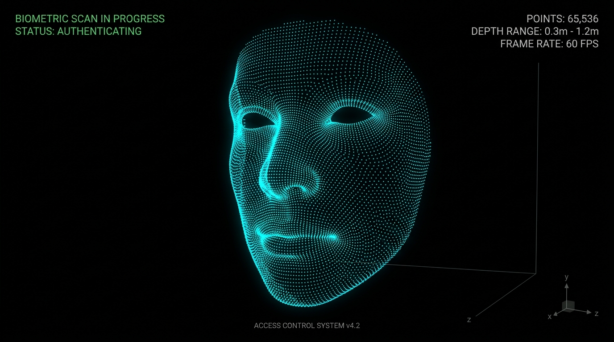

# Android 爛裝置想跑人臉辨識11 – ToF RAW12 轉 3D 點雲

> 原文網址：https://boochlin.com/?p=997
> 發布日期：2026-08-19
> 文章編號：997

---



在人臉辨識門禁機的真實專案中，除了默默在背景刷臉開門，很多高端客戶（特別是科技園區、展覽館或金融金庫）會提出一個極具科技感的需求：

**在螢幕上即時呈現賽博龐克風格的 3D 點雲人臉（Point Cloud View），並支援手指滑動旋轉。**

普通 RGB 鏡頭拍到的只是 2D 平面像素，而 Sony iToF 深度鏡頭吐出來的是整片 3D 空間的物理座標。

但算盤一撥，小學算術立刻敲碎了所有浪漫幻想：

一張 640x480 的深度影像，整整包含 **307,200 個像素點**。

每個點都要做 4 相位解調、三角函數（Atan2）、平方根開方與透視投影轉換。要把 Sony IMX516 吐出的原始生肉雜訊資料（RAW12），在 1.3GHz 的弱晶片上解算出精準的 3D 點雲與 IR 灰階圖，並以 30fps 即時渲染出來——

如果照著一般教科書寫個雙重 for 迴圈慢慢算，單幀耗時超過 **50 毫秒**！門禁機當場卡死在 15fps 以下，人臉辨識直接崩潰。

這篇就來深度拆解我們如何用 **5 道工序**、**ARM NEON 向量化** 與 **OpenGL ES 著色器**，把這 30 萬個點的解算時間從 50ms 硬生生壓進 **3ms**！

---

## 一、 iToF 物理本質：把光速映射成幾何向量

光速每秒 30 萬公里。光線從鏡頭發射打到人臉再彈回，只花了約 2 奈秒（0.000000002 秒）。普通微處理器根本按不出這種極速碼錶。

Sony iToF 採用的是 **間接飛行時間法（Indirect ToF）**：
發射特定頻率調變的紅外光波，並在 0°、90°、180°、270° 四個相位（A0, A1, A2, A3）分別積分取樣。

透過物理公式：

> I = (A0 - A2)
> Q = (A1 - A3)
> 相位差 φ = atan2(Q, I)
> 距離 d = (c / 4πf) * φ

把看不見的奈秒光速，轉化為單純的差分與三角函數運算。

---

## 二、 3D 點雲的 5 道極致工序

把 Sony 640x1920 的 RAW12 原始數據變成螢幕上的 3D 旋轉點雲，在專案中經過了 5 道精密工序：

### 工序 1：C++ 物理幾何解算（產出 4 平面連續數據 `pCloud`）

在 `RawToDepthSDK` 中，C++ 解算出包含 122.8 萬個 float 的一維連續陣列（640x480x4）：

* `[0 ~ 307,199]`：X 空間座標（公尺）
* `[307,200 ~ 614,399]`：Y 空間座標（公尺）
* `[614,400 ~ 921,599]`：Z 物理深度（公尺）
* `[921,600 ~ 1,228,799]`：IR 紅外反射強度

### 工序 2：空間過濾與背景剔除（距離 + 強度雙門檻）

在 `CameraFrameContainer.java` 中進行空間裁切：

* **紅外反射強度門檻（`pclIr > 25`）**：直接剔除空氣中的微塵雜訊與暗處噪點。
* **物理空間距離門檻（`0.2m < z < 1.2m`）**：強制只保留離鏡頭 **20 公分至 120 公分** 的人體點雲，瞬間將背後的天花板與背景牆壁剔除乾淨。

### 工序 3：`sample` 步長動態降採樣（砍掉 80% GPU 負擔）

全解析度下有 30.7 萬個點，如果全部塞給 GPU 繪圖，高通弱 GPU 會當場過熱卡頓。我們透過 `xi += sample` 進行隔點抽樣：

* `sample = 2`：抽取約 7.6 萬點（約 6.5 萬有效人臉點）。
* `sample = 4`：抽取約 1.9 萬點。

精確將每幀點數控制在 2~5 萬點，既維持了人臉五官的立體精細度，又解放了 GPU 80% 的算力！

### 工序 4：7-Float 頂點交錯排布（Stride = 28 bytes）與剛體座標變換

工控門禁機大多為直立安裝（Portrait 豎屏，例如 8 吋 800x1280），然而 ToF 感測器（如 Sony IMX516）在 PCB 硬體佈局受限於邊框寬度，通常採用 90° 橫置安裝（Landscape）。因此從相機解算出的感測器局部座標 $(x_{sensor}, y_{sensor}, z_{sensor})$，必須經過正交剛體旋轉映射至螢幕的世界座標系 $(worldX, worldY, worldZ)$。

為了讓 OpenGL 能夠以最高硬體頻寬連續讀取，每個點打包成 **7 個連續 Float（7 x 4 = 28 bytes）**：

```java
// CameraFrameContainer.java
// 90° 逆時針剛體旋轉映射：(x,y) → (-y, x)，修正橫置感測器與直立螢幕的座標正交關係
float worldX = -y; 
float worldY = x;
float worldZ = z;

outDepthResult[pointsCount * 7]     = worldX; // 世界空間坐標 X
outDepthResult[pointsCount * 7 + 1] = worldY; // 世界空間坐標 Y
outDepthResult[pointsCount * 7 + 2] = worldZ; // 世界空間坐標 Z
outDepthResult[pointsCount * 7 + 3] = colorArray[0]; // R, G, B, A 顏色 (霓虹青藍)
outDepthResult[pointsCount * 7 + 4] = colorArray[1];
outDepthResult[pointsCount * 7 + 5] = colorArray[2];
outDepthResult[pointsCount * 7 + 6] = 1.0f;
pointsCount++;
```

### 工序 5：Direct Native 記憶體零 GC 管理

在 `GlSurfacePclRender` 初始化時，直接在 Native 堆外記憶體分配 `ByteBuffer.allocateDirect()`：

運行中每一幀直接透過 `mTriangle1Vertices.put(outDepthResult)` 覆蓋寫入。**全程 0 次 Java 物件分配、0 次 GC 停頓**，保障 30fps 極致絲滑。

---

## 三、 極限加速：如何把 50ms 壓進 3ms？

在 `TofRawToDepthNeon.cpp` 裡，我們用了 3 大殺手鐧消滅 CPU 瓶頸：

### 1. Atan2 九九乘法表查表法（O(1) 記憶體尋址）

計算 `arctan2(Q, I)` 需要跑昂貴的泰勒多項式展開（耗費 50~100 個時脈）。我們預先把所有可能出現的 (Q, I) 組合計算成一張 `gAtan2Table` 查找矩陣。運算時**直接翻表查答案**，將耗時的三角函數消滅為 O(1) 的記憶體檢索（只需 1~2 個時脈）！

### 2. ARM NEON SIMD 向量並行（8 像素同時秒殺）

普通 CPU 暫存器一次只能算 1 個像素。ARM NEON 擁有 128-bit 向量暫存器，硬體在 **1 個時脈週期** 內同時載入 8 個像素的 A0, A1, A2, A3 進行並行相減（`vsubq_u16`），運算吞吐量直接暴增 8 倍！

### 3. 牛頓-拉弗森逼近開方（消滅除法與開根號硬體延遲）

在 CPU 硬體中，浮點開根號指令（`fsqrt`）需要 15~30 個時脈，會讓 CPU 流水線嚴重停擺。我們使用 ARM 硬體專屬指令 `vrsqrteq_f32` 與一輪牛頓疊代乘法，在 **3 個時脈** 內瞬間完成開方：

```cpp
// TofRawToDepthNeon.cpp: 牛頓-拉弗森逼近開方
inline static float32x4_t vsqrt(float32x4_t v) {
    float32x4_t r = vrsqrteq_f32(v);                    // 硬體求平方根倒數初始估計
    float32x4_t step = vrsqrtsq_f32(vmulq_f32(r, r), v); // 牛頓疊代：(3.0 - r^2 * v) / 2.0
    r = vmulq_f32(r, step);                              // 精煉估計值
    return vmulq_f32(v, r);                              // 倒數轉正：v * (1/sqrt(v)) = sqrt(v)
}
```

---

## 四、 OpenGL ES 3D 點雲即時渲染

解算出座標並打包為 7-Float 頂點後，在 `GlSurfacePclRender.java` 進行螢幕繪製：

```java
// GlSurfacePclRender.java
// 綁定 Position (X, Y, Z) - Offset = 0, Stride = 28 bytes
aTriangleBuffer.position(0);
GLES20.glVertexAttribPointer(mPositionHandle, 3, GLES20.GL_FLOAT, false, 28, aTriangleBuffer);
GLES20.glEnableVertexAttribArray(mPositionHandle);

// 綁定 Color (R, G, B, A) - Offset = 3, Stride = 28 bytes
aTriangleBuffer.position(3);
GLES20.glVertexAttribPointer(mColorHandle, 4, GLES20.GL_FLOAT, false, 28, aTriangleBuffer);
GLES20.glEnableVertexAttribArray(mColorHandle);

// 呼叫 GL_POINTS 繪製空間粒子
GLES20.glDrawArrays(GLES20.GL_POINTS, 0, pointsCount);
```

透過 Vertex Shader 中的 MVP 矩陣相乘，30 萬個點在螢幕上投射出隨手指滑動即時旋轉的 3D 人臉粒子。

---

## 結語與防坑心法

1. **查表法是性能王道**：不要讓 CPU 在高頻循環裡算三角函數，能查表的全部預算成矩陣。
2. **算子融合與向量化**：善用 ARM NEON `vld4q` 與牛頓逼近，消滅除法與開根號的流水線阻塞。
3. **記憶體交錯排布（Interleaved Stride）**：對齊 GPU 快取行，配合 DirectBuffer 實現全鏈路 0-GC。

下一篇，我們把視野拉回工控網路世界：**看一台掛在內網深處的門禁機，如何用 WebSocket 與 Protobuf 扛住斷網與高併發通訊！**

---

## 參考資料 (References)

1. **Sony DepthSense iToF Technology Principles**.
https://www.sony-semicon.com/en/technology/is/tof.html

2. **ARM NEON Intrinsics Reference Guide**.
https://developer.arm.com/architectures/instruction-sets/simd-isas/neon/intrinsics

3. **OpenGL ES 2.0 Programming Guide: Vertex Buffer Objects and Attributes**.
https://www.khronos.org/registry/OpenGL-Refpages/es2.0/
