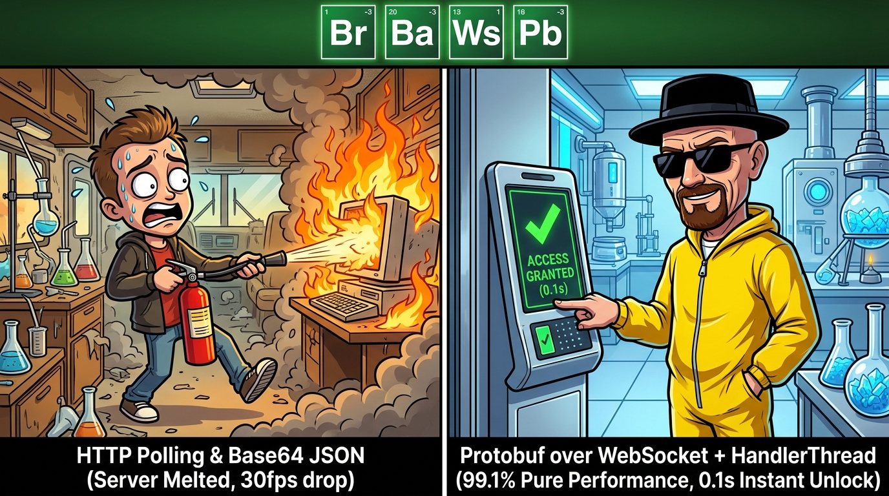

# Android 爛裝置想跑人臉辨識12 – 說到底還是一台 IOT：WebSocket 篇

> 原文網址：https://boochlin.com/?p=1010
> 發布日期：2026-08-27
> 文章編號：1010

---

> **「在百元級門禁機上做網路通訊，最天真的想法就是以為網路永遠很順；真正的工業級架構，是把每一天都當作『隨時會斷網、隨時會被拔插頭』的世界末日來設計。」**



前面幾篇我們把高通驍龍 QM215（4 顆 A53、2GB RAM）的系統瘦身與相機零拷貝榨到了極致。

但當門禁機掛上工廠大門時，現場的網路比晶片更殘酷：設備躲在企業內網深處（`192.168.1.X` 無公網 IP）、網路線隨時被拔、DNS 動輒卡死 30 秒、雲端後台隨時可能掛掉重啟。

在邊緣 IoT 系統中，WebSocket 與 RESTful API 到底該如何精準分工，做到「0.1 秒即時開門、零記憶體負擔、斷網 3 天也能穩健重連」？

---

## 一、 為什麼必須用 WebSocket？

在邊緣設備中，傳統 HTTP 短輪詢（Polling）在工廠現場會立刻遇到兩大死穴：

### 1. 延遲與伺服器當機的死循環

* **5 秒輪詢一次**：訪客站在門口按鈴，平均要乾等 2.5 秒門才會開，體驗極差。
* **200ms 輪詢一次**：全廠 100 台設備每秒產生 500 次請求，高達 4 個 RTT 的 TCP/TLS 握手瞬間打爆地端的小伺服器。

### 2. 內網 NAT 穿透困境

門禁機沒有公網 IP，雲端伺服器完全無法主動發起 HTTP POST 發送開門指令。設備必須在開機時主動向雲端伺服器建立 WebSocket 長連線，在防火牆上鑿出永久雙向通道（Pinhole）：

* **下行即時控制**：0.1 秒遠端開門、即時註銷離職員工特徵、訪客動態密碼驗證。
* **上行即時回報**：刷臉打卡抓拍照即時上傳、防拆機警報。
* **通道保活**：15 秒輕量心跳維持防火牆通道暢通。

---

## 二、 為什麼大檔案不能進 WebSocket？RESTful API 的不可替代性

如果把所有功能全部塞進 WebSocket，現場會立刻引發嚴重的開門卡死事故。RESTful API 有其專屬戰場：

### 1. 第三方系統（HR 考勤 / ERP）標準無縫對接
由後台伺服器提供標準 RESTful API，客戶用最熟悉的 HTTP 即可串接，無需在他們的系統維護脆弱的長連線。

### 2. 50MB 韌體升級與大檔案下載
50MB APK 更新檔、3D 鏡頭韌體與高解析度照片批次下載，必須走標準 HTTP 進行分段流式傳輸與斷點續傳。

### 3. 防禦 TCP 隊頭阻塞（高速公路塞車效應）
WebSocket 底層為單一 TCP 連線。若將 50MB 韌體塞進 WebSocket，會瞬間佔滿整條連線；此時若突發「緊急開門」指令，**開門封包被迫排在 50MB 檔案後面等幾十秒**，導致大門卡死打不開！

**將「大檔案傳輸（HTTP REST）」與「即時信令（WebSocket）」物理隔離，是保證 0.1 秒秒開門的關鍵底線。**

---

## 三、 資料傳輸大瘦身：為何選「Protobuf over WebSocket」？

### 1. Base64 讓記憶體直接爆炸

早期將現場照片轉為 Base64 字串塞進 JSON 傳輸：

* 體積膨脹 33%，浪費網路頻寬。
* 一張 150KB JPEG 轉成 Base64 會在 Java 記憶體產生 200KB 的 String 垃圾。尖峰期頻繁觸發 GC，相機預覽直接從 30fps 掉到個位數導致人臉丟幀。

### 2. 最佳解答：Protobuf over WebSocket 全棧大一統

維持單一 WebSocket 埠號，Payload 全面換成 Google Protocol Buffers：

```protobuf
syntax = "proto3";
package com.edge.ai.gate;

message PassEventPacket {
  string device_id = 1;
  int64 timestamp = 2;
  string user_id = 3;
  bool is_authorized = 4;

  // 原生二進位 byte 陣列直入，0 Base64、0 額外字串記憶體垃圾！
  bytes rgb_image = 5;
  bytes ir_image = 6;
  bytes depth_image = 7;
}
```

* **門禁機端**：JPEG 位元組直接塞進 Protobuf，Java 記憶體垃圾歸零，封包比 JSON 小 60%。
* **警衛室 Web 端**：Chrome 瀏覽器原生 `new WebSocket()` 直連，掛載 `protobuf.js` 一行代碼解碼，**零額外代理依賴！**

---

## 四、 邊緣裝置的穩定性實戰：單執行緒事件排隊

網路連線（DNS 解析、TCP 握手、心跳）交由專屬 `HandlerThread` 在背景單行道依序排隊：

* **UI 零延遲**：UI 呼叫僅丟 Message 排隊，0.01ms 立刻返回。
* **內部狀態封閉**：Socket 實體完全封裝在背景執行緒中，免除複雜跨執行緒加鎖。

```java
public class WebSocketWorkerManager {
    private final HandlerThread workerThread;
    private final Handler workerHandler;
    private final AtomicBoolean isConnected = new AtomicBoolean(false);

    public WebSocketWorkerManager() {
        workerThread = new HandlerThread("WebSocket-Worker");
        workerThread.start();
        workerHandler = new Handler(workerThread.getLooper()) {
            @Override
            public void handleMessage(@NonNull Message msg) {
                switch (msg.what) {
                    case MSG_CONNECT:    handleConnect((String) msg.obj); break;
                    case MSG_SEND_EVENT: handleSendEvent((byte[]) msg.obj); break;
                    case MSG_HEARTBEAT:  handleHeartbeat(); break;
                }
            }
        };
    }
}
```

---

## 五、 斷網自癒與離線資料同步（SQLite 雙指針保險）

在工廠現場，網路斷線三天是家常便飯。人臉辨識必須能離線刷臉開門，並在網路恢復後「零遺失、依序補上傳」。

初學者最容易踩的致命暗礁，就是把抓拍照片直接以 `BLOB` 塞進 SQLite：

```sql
-- 錯誤反面教材：引爆 CursorWindow 2MB 崩潰的寫法
CREATE TABLE pass_records (
    id INTEGER PRIMARY KEY AUTOINCREMENT,
    user_id TEXT NOT NULL,
    pass_time INTEGER NOT NULL,
    photo_blob BLOB, -- 致命地雷：單張抓拍照 150KB
    sync_status INTEGER DEFAULT 0
);
```

### 致命的 CursorWindow 2MB 硬上限

在 Android 9/10 中，SQLite 查詢依靠 Binder 共享記憶體傳輸，底層 `CursorWindow` 存在 **2048KB（2MB）的硬上限**。

當斷網 3 天恢復連線，即使單筆 150KB 未超限，將二進位大檔案直接存在 SQLite BLOB 欄位本身就是嚴重的反模式：查詢效能劇降、WAL 日誌膨脹、資料庫損毀風險大增。更致命的是，當相機解析度提升或 JPEG 品質調高時，單筆 BLOB 輕易突破 2MB 硬上限，引爆 `CursorWindowAllocationException`！

> 單筆照片 BLOB (> 2,048KB) > CursorWindow 單行硬上限

（註：如果只是多筆總和超過 2MB，Cursor 其實會自動分頁，只有「單筆資料」超過 2MB 才會直接引發崩潰。）

同步進程當場崩潰引發事務回滾，重連後再次拉取 20 筆再次崩潰，設備陷入「永久無法上傳離線紀錄」的死鎖；且大型 BLOB 頻繁寫入會讓 SQLite 檔案嚴重碎片化，WAL 日誌大量寫入放大更會提早損耗 Flash 晶片壽命。

### 工業級唯一解：磁碟流式存儲 + 資料庫路徑指標

工控系統的合規架構是：**「大二進位檔案走私有檔案系統，資料庫僅存路徑指標」**。

```sql
-- 正確架構：資料庫只存路徑指標，單行僅幾十 bytes
CREATE TABLE pass_records (
    id INTEGER PRIMARY KEY AUTOINCREMENT,
    user_id TEXT NOT NULL,
    pass_time INTEGER NOT NULL,
    photo_path TEXT NOT NULL, -- 內部絕對路徑，如 /data/user/0/.../snapshots/uuid.jpg
    sync_status INTEGER DEFAULT 0 -- 0: 未同步, 1: 同步中, 2: 已確認
);
```

```java
// 1. 抓拍當下：流式寫入私有磁碟（0 SQLite 事務日誌負擔）
File snapshotFile = new File(getSnapshotDir(), UUID.randomUUID().toString() + ".jpg");
saveImageToDisk(snapshotFile, jpegBytes);

// 2. 離線寫入：SQLite 僅記錄路徑指標（20 筆查詢僅 1KB，絕無 CursorWindow 超限風險）
ContentValues cv = new ContentValues();
cv.put("user_id", userId);
cv.put("pass_time", System.currentTimeMillis());
cv.put("photo_path", snapshotFile.getAbsolutePath());
cv.put("sync_status", 0);
db.insert("pass_records", null, cv);

// 3. 連線恢復：分段流式上傳，收到 ACK 確認後自動物理刪除圖檔
List<PassRecord> records = queryPendingRecords(20);
for (PassRecord record : records) {
    byte[] photoData = readFileToByteArray(record.getPhotoPath());
    sendOverWebSocket(record, photoData);
}

// 收到雲端伺服器 ACK 後：
// db.update("pass_records", sync_status = 2)
// new File(record.getPhotoPath()).delete(); // 釋放本地磁碟
```

---

## 結語與防坑心法

1. **通道分離**：信令走 WebSocket，大檔走 HTTP REST，嚴防隊頭阻塞。
2. **二進位壓榨**：用 Protobuf 幹掉 JSON 與 Base64，拯救 Java Heap 與頻寬。
3. **CursorWindow 絕緣**：大二進位圖片嚴禁進 SQLite，磁碟落檔 + 資料庫記錄指標是唯一的生存法則。
4. **離線優先**：地端先行，開門不依賴網路，雲端同步永遠走非同步 ACK 閉環。

下一篇，我們聊聊一個為了幾乎不會用到的功能，卻需要大改特改系統底層的終極大坑：**WebRTC 視訊對講與相機爭搶！**

---

## 參考資料 (References)

1. **RFC 6455: The WebSocket Protocol**.
https://datatracker.ietf.org/doc/html/rfc6455

2. **Protocol Buffers Developer Guide: Java Generated Code**.
https://protobuf.dev/getting-started/javatutorial/

3. **SQLite Architecture and WAL Mode in Android**.
https://developer.android.com/reference/android/database/sqlite/SQLiteDatabase
