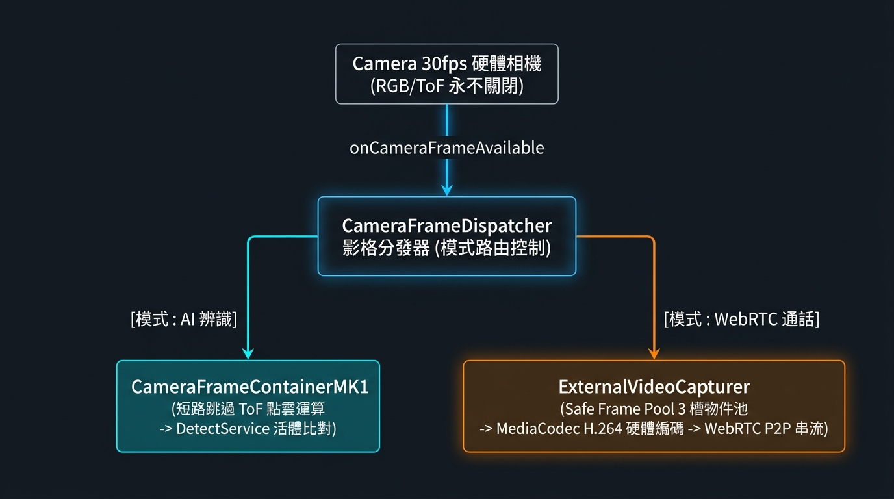

# Android 爛裝置想跑人臉辨識13 – 為了幾乎不會用到的功能需要大改特改的 WebRTC

> 原文網址：https://boochlin.com/?p=1015
> 發布日期：2026-08-29
> 文章編號：1015

---

寫 WebRTC 的人都知道那句老話：**Demo 跑通官方範例只要兩小時，上線除錯要花整整兩年。**

尤其當你的載體是一塊算力被閹割的高通 Snapdragon QM215（4 顆 A53、2GB RAM）時，系統既要維持 7x24 小時雙鏡頭活體人臉辨識，老闆又硬塞了一個「訪客按鈴即時視訊對講」需求。

在門禁機的日常狀態下，相機是一條瘋狂運轉的高速輸送帶：RGB 與 ToF 鏡頭以 30fps 採集畫面，C++ JNI 生成 3D 點雲，OpenGL ES 繪製預覽，同時推入 AI 管線進行特徵比對。

系統本來跑得好好的，直到對講需求砸下來。

底層立刻引爆了致命衝突：**Android 的 `cameraserver` 是絕對排他性的，同一個 Camera ID 在同一瞬間只能被一個 Client 打開**。

AI 辨識霸佔相機不放，WebRTC 又急著搶相機，兩個互不相識的模組在底層硬碰硬。

---

## 最初的爛解法：sleep 5 秒鴕鳥術

最初接手的工程師為了趕上線，採用了工程界最經典的「鴕鳥策略」：**要對講就把 AI 相機徹底關掉；要回主畫面再把 WebRTC 相機徹底關掉**。

於是在程式碼裡留下了這段令人哭笑不得的歷史遺產：

```java
// RecognitionFragment.java
DetectService.instance().stopDetection();
CameraProxy.getInstance().setCameraDeviceStateCallback(new ICameraInstance.CameraStateCallback() {
    @Override
    public void onClosed(int cameraId) {
        if (cameraId == ICameraInstance.ALL) {
            // 收到關閉通知後，在 UI 線程硬等 5 秒！
            ThreadPoolManager.getInstance().runOnUiThreadDelay(() -> {
                iSwitcher.switchTo(Const.MAIN_FRAGMENT, WebRTCFragment.class.getName());
            }, 5000);
        }
    }
});
ThreadPoolManager.getInstance().execute(() -> {
    CameraProxy.getInstance().close();
});
```

這段代碼完美體現了「能跑就不要動」的精髓，但也埋下了兩顆地雷：

### 1. 去程 5 秒黑屏與 onClosed 的假象欺騙

訪客按門鈴後，螢幕黑屏整整 5 秒。為什麼不敢設 500ms？因為底層 `CameraInstance.java` 裡的 `onClosed(ALL)` 根本是個假訊號：

```java
// CameraInstance.java
mRgbCamera.stopCameraSession();
mRgbCamera.close();

if (stateCallback != null) {
    stateCallback.onClosed(ALL); // 剛發出關閉指令就立刻同步回呼！
}
```

`onClosed` 只代表「Java 層發出了關閉請求」，底層 Linux Kernel 的相機設備節點根本還在釋放 DMA 記憶體與清理 HAL 狀態。開發者不知道底層到底何時放手，只好展現工程師的浪漫——「我不知道它何時關完，但我賭 5 秒後它肯定下班了」。

### 2. 回程 0 毫秒搶相機引發崩潰死鎖

更精彩的是掛斷通話時：

```java
// WebRTCFragment.java
private void hangup() {
    face3DWebRTC.hangup();
    face3DWebRTC.release(); // 內部透過背景 CameraThread 非同步關相機
    face3DWebRTC = null;

    // 0 毫秒瞬間切回主畫面！
    iSwitcher.switchTo(WebRTCFragment.class.getName(), Const.MAIN_FRAGMENT);
}
```

主線程 0ms 切回主畫面，`RecognitionFragment.onResume()` 秒呼 `CameraProxy.open()`。

但 WebRTC 的背景執行緒甚至還沒向相機驅動說完再見，主畫面就一腳踹開大門進來搶相機。結果 `cameraserver` 當場噴出 `CAMERA_IN_USE` 異常，**相機直接死鎖黑屏，整棟大樓的住戶站在門口跟你面面相覷，只能拔插頭重開機**。

---

## 終極架構：永遠不要關閉相機（記憶體偷天換日）

既然開關相機是一場豪賭，那我們老鳥最擅長的招數就來了：**永遠不要關相機，假裝無事發生，在記憶體裡偷天換日動態轉發影格！**



### 1. 消除 Data Race：帶有釋放保護的物件池

WebRTC MediaCodec 硬體編碼是非同步的。如果不做物件池，相機 33ms 吐一幀，WebRTC 40ms 才編完，下一幀會直接在編碼器嘴巴裡塞進新數據，遠端警衛看到的就不只是訪客，而是二維維度打擊般的現代藝術綠屏。

透過 3 槽位物件池搭配 `releaseCallback` 實現精準管理：

```java
public class SafeWebRtcFramePool {
    private static final int POOL_SIZE = 3;
    private final byte[][] buffers = new byte[POOL_SIZE][];
    private final boolean[] inUse = new boolean[POOL_SIZE];

    public synchronized byte[] acquire(int size) {
        for (int i = 0; i < POOL_SIZE; i++) {
            if (!inUse[i]) {
                inUse[i] = true;
                if (buffers[i] == null || buffers[i].length != size) {
                    buffers[i] = new byte[size];
                }
                return buffers[i];
            }
        }
        return null; // 滿載時安全拋棄本幀，絕不踩踏
    }

    public synchronized void release(byte[] buffer) {
        for (int i = 0; i < POOL_SIZE; i++) {
            if (buffers[i] == buffer) {
                inUse[i] = false;
                break;
            }
        }
    }
}
```

### 2. 被動式 WebRTC 外部採集器（ExternalVideoCapturer）

我們不再讓 WebRTC 去管 Camera 開關，而是建立一個被動接收影像幀的自訂採集器：

```java
public class ExternalVideoCapturer implements VideoCapturer {
    private CapturerObserver capturerObserver;
    private volatile boolean isCapturing = false;
    private final SafeWebRtcFramePool framePool = new SafeWebRtcFramePool();

    public void feedRawFrame(byte[] nv21Data, int width, int height, int rotation) {
        if (!isCapturing || capturerObserver == null || nv21Data == null) return;

        byte[] safeBuffer = framePool.acquire(nv21Data.length);
        if (safeBuffer == null) return;

        System.arraycopy(nv21Data, 0, safeBuffer, 0, nv21Data.length);
        long timestampNs = TimeUnit.MILLISECONDS.toNanos(SystemClock.elapsedRealtime());

        // safeBuffer 綁定 releaseCallback：編碼完成後自動歸還物件池
        NV21Buffer buffer = new NV21Buffer(safeBuffer, width, height, () -> {
            framePool.release(safeBuffer);
        });

        VideoFrame videoFrame = new VideoFrame(buffer, rotation, timestampNs);
        capturerObserver.onFrameCaptured(videoFrame);
        videoFrame.release();
    }
}
```

### 3. 一刀切換，0 秒黑屏

在主相機流水線中，我們只保留一個布林標誌：

```java
// CameraRgbHelper.java
if (mIsIntercomActive) {
    mExternalCapturer.feedRawFrame(nv21, width, height, rotation);
}
```

訪客按鈴切換對講時，耗時從原本的 **5000ms 直接暴跌至 0ms**！相機根本沒關過，硬體狀態紋風不動，只是多了一條分支把記憶體拷貝進 WebRTC 編碼隊列。

通話結束時把標誌設為 false，主畫面無縫繼續人臉辨識，徹底消滅 `CAMERA_IN_USE` 異常。

---

## 結語與防坑心法

1. **不要相信非同步的 onClosed**：硬體驅動的釋放往往遠落後於 Java 抽象層的通知，靠 sleep 賭運氣早晚要翻車。
2. **化被動為主動**：面對排他性硬體資源，永遠不要讓兩個上層模組搶著當主人。將硬體包裝成單一常駐源，用分發器向多個消費者分發影格。
3. **有借有還的 Buffer Pool**：高頻影像進入非同步編碼器時，必須用帶有生命週期回調的緩衝池杜絕綠屏與記憶體洩漏。

---

## 參考資料 (References)

1. **WebRTC Official Native VideoCapturer Specification**.
https://webrtc.googlesource.com/src/+/refs/heads/main/sdk/android/api/org/webrtc/VideoCapturer.java

2. **Android CameraServer IPC Architecture & Device State Callback**.
https://source.android.com/docs/core/camera

3. **Android MediaCodec Asynchronous Processing Mode**.
https://developer.android.com/reference/android/media/MediaCodec
