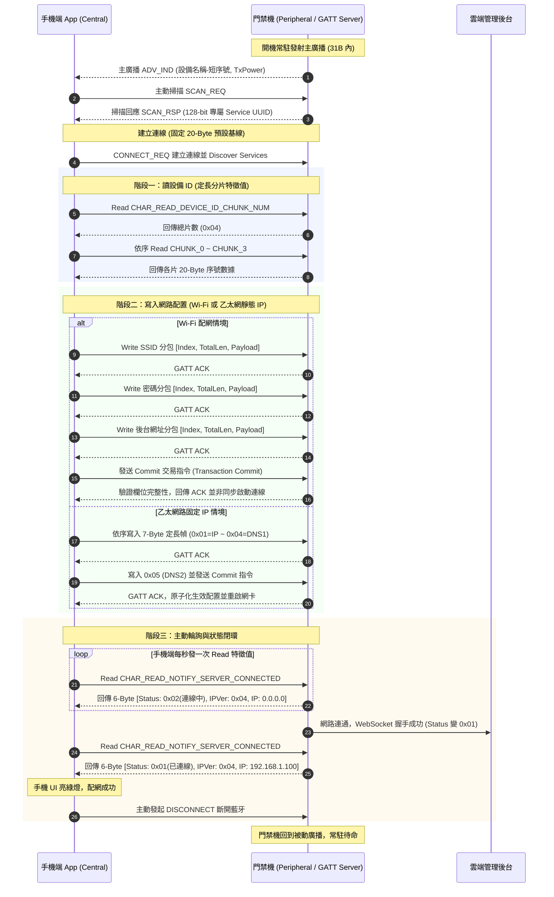

# Android 爛裝置想跑人臉辨識14 – 門禁機當 BLE Peripheral 的現場踩坑記

在邊緣工控場景中，有一款型號叫 **Mkspure**。這是一台專為嚴苛環境設計的純硬體設備：**沒有螢幕、沒有鍵盤、零實體按鍵**。

設備被金屬支架死死釘在兩公尺高的立柱上。一旦工廠現場更換了 WiFi 基地台、改了密碼，或者需要設定固定 IP，連操作介面都沒有，總不可能叫維護人員扛著鋁梯拆外殼接串口線調試。

讓門禁機作為 **BLE Peripheral（GATT Server）**，讓現場人員拿手機透過藍牙連線完成配網，是這台純硬體盲盒機在現場最核心的通訊生命線。

這篇不談花拳繡腿，直接從 `BleService.java` 與 `BleUtils.java` 的真實代碼出發，還原這套 BLE 配網通道的真實協議實作、現場物理邊界，以及從「現場救火原型」演進至「商用量產防禦」的架構思考。

---

## 核心交互時序

手機與門禁機的配網流程，依序分為「讀取設備識別」、「寫入網路參數」、「輪詢連線狀態」三個階段：




---

## 一、 廣播層：31-Byte 限制與前綴裁剪

標準 BLE Legacy 廣播封包的淨載上限只有 **31 Bytes**。扣除廣播 Flags（3 Bytes）與長度開銷，留給設備名稱與廣播資料的空間極其有限。

門禁機出廠序號自帶 4 碼廠商識別前綴（例如 `PROD12345678`）。如果直接把完整的設備型號連同序號塞入名稱，再加上 16 Bytes 的 128-bit 服務 UUID，廣播封包立刻突破 31 Bytes，`mBluetoothLeAdvertiser.startAdvertising()` 會直接拋出 `ADVERTISE_FAILED_DATA_TOO_LARGE`（錯誤碼 1）。

現場救火時的最直接解法，是採用雙層廣播拆分：

```java
// File: BleService.java (行 156-158)
// 裁掉固定 4 碼廠商前綴，確保壓在 31-Byte 限制內
uniqueSerial = DeviceCodeUtils.getSerialNum().substring(4);
bluetoothAdapter.setName(deviceName + "-" + uniqueSerial);
```

1. **第一層主廣播（ADV_IND）**：只放裁剪後的短機號與發射功率，壓在 31 Bytes 內常駐廣播。
2. **第二層掃描回應（SCAN_RSP）**：把長達 16 Bytes 的 128-bit Service UUID 挪到第二層，僅在手機發起主動掃描（SCAN_REQ）時回傳。

### 架構深思：31-Byte 的邊界計算防線

在救火原型中，`substring(4)` 假設了序號結構永遠固定且為純 ASCII。但在商用量產環境中，**BLE 廣播長度是嚴格以 UTF-8 位元組（Bytes）計算，而非 Java 字元數**。Legacy Advertising 的 31 Bytes 包含每個 AD Structure 的長度與標頭開銷：
* `Flags`：3 Bytes（長度 1B + 類型 1B + 數據 1B）
* `Tx Power`：3 Bytes
* `Local Name` 標頭：2 Bytes（長度 1B + 類型 1B）

若要避免在各種 OEM 藍牙晶片或異常序號下崩潰，商用級代碼應採 CodePoint 級的 UTF-8 位元組預算裁剪：

```java
private static final int LEGACY_ADV_MAX_BYTES = 31;
private static final int FLAGS_AD_BYTES = 3;
private static final int LOCAL_NAME_OVERHEAD = 2;

static String buildSafeAdvertisedName(String deviceName, String serialSuffix, int reservedBytes) {
    String desired = deviceName + "-" + serialSuffix;
    // 精確扣除廣播 Flags 與標頭開銷，計算剩餘的位元組預算
    int nameBudget = LEGACY_ADV_MAX_BYTES - reservedBytes - LOCAL_NAME_OVERHEAD;
    if (nameBudget <= 0) return deviceName;

    StringBuilder sb = new StringBuilder();
    int used = 0;
    for (int i = 0; i < desired.length(); ) {
        int cp = desired.codePointAt(i);
        int charBytes = new String(Character.toChars(cp)).getBytes(StandardCharsets.UTF_8).length;
        if (used + charBytes > nameBudget) break;
        sb.appendCodePoint(cp);
        used += charBytes;
        i += Character.charCount(cp);
    }
    return sb.toString();
}
```

---

## 二、 傳輸層：20-Byte 限制下的三個資料流實作

BLE 預設的 ATT MTU 單包淨載為 **20 Bytes**。配網資料雖然量不大，但仍包含 64 碼設備識別碼、WiFi 帳密以及 IP 參數。代碼針對不同資料屬性，實作了三種傳輸方式：


### 2.1 讀取 Device ID：定長分片特徵值
設備 ID 為 64 碼（AES 加密晶片識別碼），無法單包傳輸。代碼在 GATT 服務中動態註冊 4 個 20-Byte 的分片特徵值（CHUNK_0 ~ CHUNK_3），並在讀取回調中用特徵值末碼計算偏移：

```java
// File: BleService.java (行 286-291)
// 64 碼序號拆 4 片特徵值，依 UUID 末碼字元計算資料偏移
char[] uuid = characteristic.getUuid().toString().toCharArray();
int shift = 20 * (uuid[uuid.length - 1] - '0');
mBluetoothGattServer.sendResponse(device, requestId, BluetoothGatt.GATT_SUCCESS, 0,
    Arrays.copyOfRange(DeviceCodeUtils.getCode().getBytes(StandardCharsets.UTF_8), shift, shift + 20));
```

手機端先讀取 `CHAR_READ_DEVICE_ID_CHUNK_NUM` 取得總片數（`0x04`），再依序發起 4 次讀取拼出完整 64 碼。靜態特徵值映射徹底繞過了協議棧內部的動態 offset 狀態維護。

### 2.2 寫入 WiFi 帳密：2-Byte 標頭滑動分包
對於長度不定的 SSID、密碼與後台網址，協議定義了 2-Byte 標頭結構：`[Index(1B), TotalLength(1B), Payload(10B)]`。每包淨載固定 10 Bytes，加上標頭共 12 Bytes。

```java
// File: BleUtils.java (行 43-55)
// bytes[0]=Index, bytes[1]=TotalLength
int expectedLen = bytes[0] * 10;
if (expectedLen < sb.length()) {
    sb.delete(0, sb.length()); // 序號重置：手機重傳，清空緩衝區重新接收
} else if (expectedLen != sb.length()) {
    return false;              // 序號不匹配：表示掉包，拒絕拼接
}

// 關鍵修正：截斷前 2 Bytes 標頭，只取實際 payload
String payload = new String(bytes, 2, bytes.length - 2, StandardCharsets.UTF_8);
sb.append(payload);
return bytes[1] == sb.length();  // 累積長度達到預期總長時返回 true
```

#### 工程演進：從共享緩衝到 Byte-oriented 重組器
在現場原型中，透過 `index * 10 == sb.length()` 校驗分包順序，並利用靜態物件複用壓低 GC 開銷。然而在更高標準的商用設計中，將分包直接累積為 String 存在 UTF-8 多位元組字元跨包割裂的風險。

更健壯的解法是先在二進位層級（`ByteArrayOutputStream`）完成組包與 Sequence 校驗，收齊後再做一次性 UTF-8 解碼，徹底防範字元截斷與並發重入污染：

```java
final class FragmentAssembler {
    private final int txId;
    private final int totalBytes;
    private final ByteArrayOutputStream buffer = new ByteArrayOutputStream();
    private int nextSeq = 0;

    boolean append(int incomingTxId, int seq, byte[] payload) {
        if (incomingTxId != txId || seq != nextSeq) return false;
        if (buffer.size() + payload.length > totalBytes) return false;

        buffer.write(payload, 0, payload.length);
        nextSeq++;
        return true;
    }

    String finishUtf8() throws CharacterCodingException {
        return StandardCharsets.UTF_8.newDecoder()
            .onMalformedInput(CodingErrorAction.REPORT)
            .decode(ByteBuffer.wrap(buffer.toByteArray())).toString();
    }
}
```

### 2.3 寫入乙太網路靜態 IP：7-Byte 定長控制幀
乙太網路參數（IP、掩碼、網關、DNS）皆為固定 4 Bytes 的 IPv4 地址。代碼直接採用 7-Byte 定長幀，無需 Length 欄位：
`[Type(1B), Ver(1B), Key(1B), IPv4(4B)]`

```java
// File: BleService.java (行 424-437 節選)
case 0x05: // Key 0x05 (DNS2) 作為最後一筆配置，觸發配置生效
    staticIpConfig.dns2 = BleUtils.ipv4ToString(ipBytes);
    ethernetManager.setStaticIp(staticIpConfig); // 生效配置並重啟網卡
    staticIpConfig = null;
    break;
```

手機端依序寫入 IP 至 DNS1，收到最後一筆 DNS2（Key `0x05`）時，門禁機判定所有靜態參數已齊全，調用系統專屬的 `EthernetManager` 重啟網卡生效。

---

## 三、 狀態同步與流程銜接：從「時間巧合」到「顯式 Transaction」

### 3.1 原始代碼的時序盲點
在早期 Wi-Fi 配網實作中，手機端會連續發送 SSID、密碼與後台網址。設備端的銜接代碼位於 `connectToWifi`：

```java
// File: BleService.java (行 528-542 節選)
// Wi-Fi 握手成功後，非同步等待後台網址接收完成
int count = 0;
while (count < 10) {
    if (serverHostDone) { // 後台網址已收齊，寫入配置
        SettingServ.setSyncServerIp(sbServerHost.toString().replaceFirst("^(http[s]?://)", ""));
        serverHostDone = false;
        return;
    }
    Thread.sleep(2000);
    count++;
}
```

* **現場時序依賴**：這段代碼隱含了一個時序假設——手機端會在 1 秒內連續發送完畢，而 Wi-Fi 連線與 DHCP 分配需要 2~5 秒。因此當連線成功回調觸發時，後台網址「通常」已收齊。
* **架構隱患**：一旦 Wi-Fi 晶片快取了熱點資訊而瞬間秒連，或手機端排程延遲，設備就會套用半殘的設定；且輪詢 20 秒超時後缺乏清晰的失敗回滾與診斷回報。

### 3.2 量產級演進：顯式 Commit 與可診斷狀態機（FSM）

成熟的工控通訊必須消除「賭時序」的寫法。正確模型是**顯式交易（Transaction Commit）**：
1. **暫存接收**：手機發送 SSID、密碼與後台網址，設備僅存入交易暫存區。
2. **顯式 Commit**：手機所有資料寫畢後，發送 Commit 指令。
3. **原子校驗與套用**：設備驗證必填欄位完整性，持久化設定後啟動網路連線，並回報診斷狀態碼。

```java
// 現場可診斷的狀態碼枚舉
public enum ProvisionStatus {
    IDLE((byte) 0x00),
    SUCCESS((byte) 0x01),                  // 成功（Wi-Fi + 後台握手全通）
    CONNECTING((byte) 0x02),               // 網路關聯與交握中
    WIFI_AUTH_FAILED((byte) 0x03),         // 密碼錯誤
    SSID_NOT_FOUND((byte) 0x04),           // 找不到 Wi-Fi 熱點
    BACKEND_HANDSHAKE_FAILED((byte) 0x05), // 雲端後台連線或握手失敗
    INVALID_CONFIG((byte) 0x06),           // 參數校驗失敗
    NETWORK_TIMEOUT((byte) 0x07);          // DHCP 分配或連線超時

    public final byte code;
    ProvisionStatus(byte code) { this.code = code; }
}

public void commitProvision(int transactionId) {
    ProvisionTransaction tx;
    synchronized (lock) {
        if (activeTransaction == null || activeTransaction.id != transactionId) {
            publishStatus(ProvisionStatus.INVALID_CONFIG, (byte) 0x01);
            return;
        }
        if (!activeTransaction.isComplete()) {
            publishStatus(ProvisionStatus.INVALID_CONFIG, (byte) 0x02);
            return;
        }
        tx = activeTransaction;
        activeTransaction = null; // 防止重複觸發
    }

    publishStatus(ProvisionStatus.CONNECTING, (byte) 0x00);
    executor.execute(() -> {
        try {
            // 原子化寫入配置檔
            persistProvisionConfig(tx);

            // 連線 Wi-Fi
            WifiConnectResult res = connectWifi(tx.ssid, tx.passwordBytes);
            if (res == WifiConnectResult.AUTH_FAILED) {
                publishStatus(ProvisionStatus.WIFI_AUTH_FAILED, (byte) 0);
                return;
            }

            // 驗證後台連通性
            if (!verifyBackendHandshake(tx.serverHost)) {
                publishStatus(ProvisionStatus.BACKEND_HANDSHAKE_FAILED, (byte) 0);
                return;
            }

            publishStatus(ProvisionStatus.SUCCESS, (byte) 0);
        } finally {
            Arrays.fill(tx.passwordBytes, (byte) 0); // 密碼記憶體歸零清除
        }
    });
}
```

手機端不再只能看著「連線中」乾等，一旦密碼打錯或後台網址填錯，狀態特徵值能精準回報 `0x03` 或 `0x05`，現場人員秒知問題所在。

---

## 四、 商用門禁的最低資安防線

在工控與公共安全場景中，BLE 配網承載的是 Wi-Fi 金鑰與雲端管理後台端點，絕不能把「人在設備旁邊」當成授權依據。量產版本必須建立最低防禦邊界：

1. **出廠預共享金鑰（PSK）與挑戰應答（Challenge-Response）**：
   每台設備出廠擁有專屬 PSK。手機透過 BLE 連線後，設備生成隨機 Nonce 發給手機，手機使用 PSK 計算 HMAC-SHA256 回傳。門禁機校驗通過前，**拒絕任何特徵值的寫入與讀取**，防止陌生手機任意覆寫配網參數。
2. **防重放機制（Anti-Replay）**：
   所有寫入分包均綁定當次連線生成的 `Transaction ID` 與嚴格遞增的 `Sequence`，現場抓包無法錄製重放。
3. **記憶體安全衛生（Memory Hygiene）**：
   Wi-Fi 密碼等高度敏感資訊以 `byte[]` 處理，使用完畢後立即以 `Arrays.fill(bytes, (byte) 0)` 抹除，嚴禁轉化為不可變的 Java `String` 長期滯留於 Dalvik Heap 中被 Heap Dump 抓取。

---

## 結語

工控場景的邊緣通訊，不需要花哨的動態協商，但必須具備**狀態可觀測性與失敗防禦力**。

面對無螢幕的工控盲盒機，一套基於 31-Byte 廣播拆分、20-Byte 定長分包與主動輪詢的通道，在量產救火初期以極精簡的代碼完成了從硬體識別、網路配置到狀態驗證的全流程閉環。

然而，一個真正成熟的商用系統，絕不能依賴「剛好連上」的時間巧合；唯有透過**顯式 Transaction Commit、完備的診斷狀態機（FSM）、以及記憶體敏感資料擦除**，才能在惡劣的電磁環境與網路波動下，提供真正堅固的工業級可靠性。
