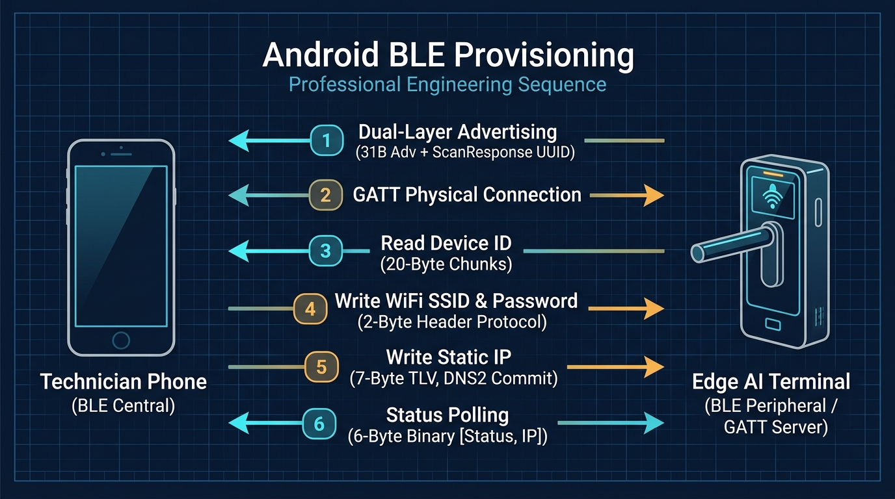
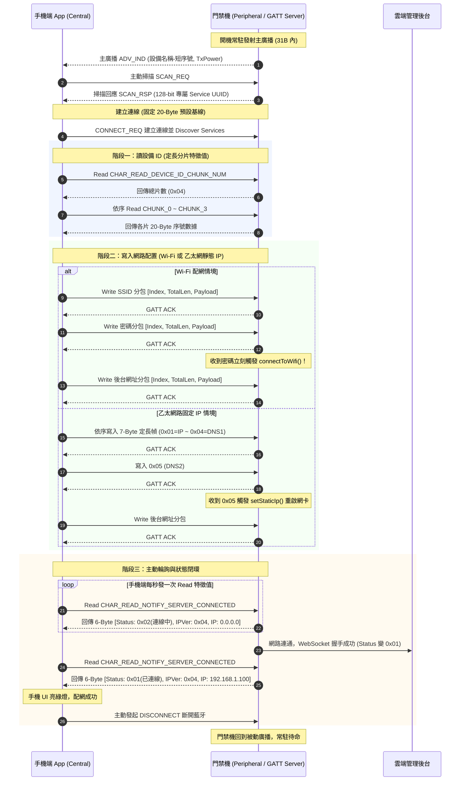
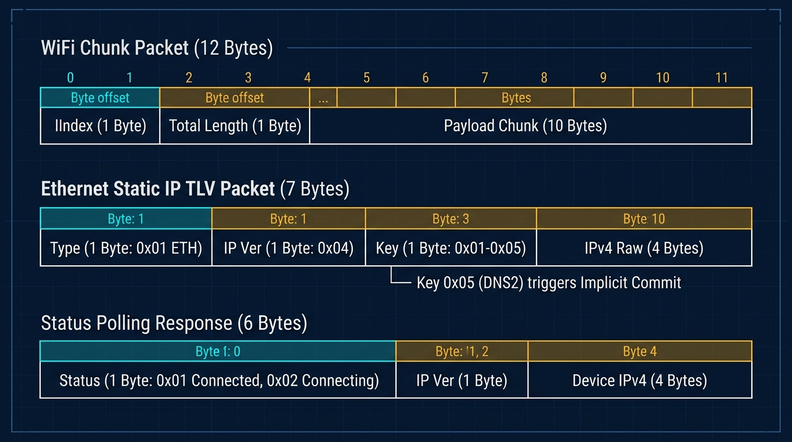

# Android 爛裝置想跑人臉辨識14 – 門禁機當 BLE Peripheral 的現場踩坑記

在邊緣工控場景中，有一款型號叫 **Mkspure**。這是一台專為嚴苛環境設計的純硬體設備：**沒有螢幕、沒有鍵盤、零實體按鍵**。

設備被金屬支架死死釘在兩公尺高的立柱上。一旦工廠現場更換了 WiFi 基地台、改了密碼，或者需要設定固定 IP，連操作介面都沒有，總不可能叫維護人員扛著鋁梯拆外殼接串口線調試。

讓門禁機作為 **BLE Peripheral（GATT Server）**，讓現場人員拿手機透過藍牙連線完成配網，是這台純硬體盲盒機在現場最核心的通訊生命線。

這篇不談花拳繡腿，直接從 `BleService.java` 與 `BleUtils.java` 的真實代碼出發，還原這套 BLE 配網通道的真實協議實作與現場物理邊界。

---

## 核心交互時序

手機與門禁機的配網流程，依序分為「讀取設備識別」、「寫入網路參數」、「輪詢連線狀態」三個階段：





---

## 一、 廣播層：31-Byte 限制與前綴裁剪

標準 BLE 廣播封包的淨載上限只有 **31 Bytes**。扣除廣播 Flags（3 Bytes）與長度開銷，留給設備名稱與廣播資料的空間極其有限。

門禁機出廠序號自帶 4 碼廠商識別前綴（例如 `PROD12345678`）。如果直接把完整的設備型號連同序號塞入名稱，再加上 16 Bytes 的 128-bit 服務 UUID，廣播封包立刻突破 31 Bytes，`mBluetoothLeAdvertiser.startAdvertising()` 會直接拋出 `ADVERTISE_FAILED_DATA_TOO_LARGE`（錯誤碼 1）。

代碼的解法很單純，採用雙層廣播架構：

```java
// File: BleService.java (行 156-158)
// 裁掉固定 4 碼廠商前綴，確保壓在 31-Byte 限制內
uniqueSerial = DeviceCodeUtils.getSerialNum().substring(4);
bluetoothAdapter.setName(deviceName + "-" + uniqueSerial);
```

1. **第一層主廣播（ADV_IND）**：只放裁剪後的短機號與發射功率，壓在 31 Bytes 內常駐廣播。
2. **第二層掃描回應（SCAN_RSP）**：把長達 16 Bytes 的 128-bit Service UUID 挪到第二層，僅在手機發起主動掃描（SCAN_REQ）時回傳。

---

## 二、 傳輸層：20-Byte 限制下的三個資料流實作

BLE 預設的 ATT MTU 單包淨載為 **20 Bytes**。配網資料雖然量不大，但仍包含 64 碼設備識別碼、WiFi 帳密以及 IP 參數。代碼針對不同資料屬性，實作了三種傳輸方式：



### 2.1 讀取 Device ID：定長分片特徵值
設備 ID 為 64 碼（AES 加密晶片識別碼），無法單包傳輸。代碼在 GATT 服務中動態註冊 4 個 20-Byte 的分片特徵值（CHUNK_0 ~ CHUNK_3），並在讀取回調中用特徵值末碼計算偏移：

```java
// File: BleService.java (行 286-291)
// 64 碼序號拆 4 片特徵值，依 UUID 末碼字元計算資料偏移
char[] uuid = characteristic.getUuid().toString().toCharArray();
int shift = 20 * (uuid[uuid.length - 1] - '0');
mBluetoothGattServer.sendResponse(device, requestId, BluetoothGatt.GATT_SUCCESS, 0,
    Arrays.copyOfRange(DeviceCodeUtils.getCode().getBytes(), shift, shift + 20));
```

手機端先讀取 `CHAR_READ_DEVICE_ID_CHUNK_NUM` 取得總片數（`0x04`），再依序發起 4 次讀取拼出完整 64 碼。靜態特徵值映射徹底繞過了協議棧內部的動態 offset 狀態維護。

### 2.2 寫入 WiFi 帳密：2-Byte 標頭滑動分包
對於長度不定的 SSID、密碼與後台網址，協議定義了 2-Byte 標頭結構：`[Index(1B), TotalLength(1B), Payload(10B)]`。每包淨載固定 10 Bytes，加上標頭共 12 Bytes。

```java
// File: BleUtils.java (行 43-55)
// bytes[0]=Index, bytes[1]=TotalLength
int expectedLen = bytes[0] * 10;
if (expectedLen < sb.length()) {
    sb.delete(0, sb.length()); // 序號重置：手機重傳，清空緩衝區重新接收
} else if (expectedLen != sb.length()) {
    return false;              // 序號不匹配：表示掉包，拒絕拼接
}

sb.append(bytesToString(bytes)); // 剝離前 2 Bytes 標頭（底層走靜態共享陣列解包）
return bytes[1] == sb.length();  // 累積長度達到預期總長時返回 true
```

利用 `index * 10 == sb.length()` 校驗分包順序，手機重發第一包時自動清空重收；解包時透過 `static byte[] stringBytes` 共享緩衝區處理，在單手機循序配網下有效避開了頻繁配置物件的 GC 開銷。

### 2.3 寫入乙太網路靜態 IP：7-Byte 定長控制幀與隱式 Commit
乙太網路參數（IP、掩碼、網關、DNS）皆為固定 4 Bytes 的 IPv4 地址。代碼直接採用 7-Byte 定長幀，無需 Length 欄位：
`[Type(1B), Ver(1B), Key(1B), IPv4(4B)]`

```java
// File: BleService.java (行 424-437 節選)
case 0x05: // Key 0x05 (DNS2) 作為最後一筆配置，觸發隱式 Commit
    staticIpConfig.dns2 = BleUtils.ipv4ToString(ipBytes);
    ethernetManager.setStaticIp(staticIpConfig); // 生效配置並重啟網卡
    staticIpConfig = null;
    break;
```

手機端依序寫入 IP 至 DNS1，收到最後一筆 DNS2（Key `0x05`）時，門禁機判定所有靜態參數已齊全，直接調用 `EthernetManager` 重啟網卡生效，省略額外的確認握手。

---

## 三、 狀態同步：6-Byte 定長狀態幀與主動輪詢

配網完成後，設備是否成功聯網、是否連上雲端管理後台，需要向手機端回報狀態。

代碼讓設備保持無狀態，提供一個 6-Byte 定長狀態特徵值供手機主動 Read 輪詢：

```java
// File: BleService.java (行 307-317 節選)
// 回傳 6-Byte 定長狀態幀: [Status(1B), IPv4_Version(1B), IP_Address(4B)]
byte status = SyncDataService.getInstance().isConnected() ? 0x01 : 0x02;
byte[] bytes = BleUtils.deviceIpv4ToBytes(status, DeviceServ.getDeviceDBItem().getIpAddress());
mBluetoothGattServer.sendResponse(device, requestId, BluetoothGatt.GATT_SUCCESS, offset, bytes);
```

手機端在送出配網參數後，每秒發起一次 Read：
1. 讀取到 `Status == 0x02`，手機 UI 顯示「連線中...」；
2. 門禁機與雲端後台 WebSocket 握手成功後，底層狀態變更為 `0x01`；
3. 手機讀到 `0x01`，解析出後 4 Bytes 的真實分配 IP，UI 亮綠燈提示成功；
4. 手機端主動發起 `DISCONNECT` 斷開藍牙，完成整個配網閉環。

---

## 四、 流程銜接：Wi-Fi 連線與後台網址的寫入時序

在 Wi-Fi 配網流程中，手機端連續寫入 SSID、密碼與後台網址。設備端的銜接代碼位於 `connectToWifi`：

```java
// File: BleService.java (行 528-542 節選)
// Wi-Fi 握手成功後，非同步等待後台網址接收完成
int count = 0;
while (count < 10) {
    if (serverHostDone) { // 後台網址已收齊，寫入配置
        SettingServ.setSyncServerIp(sbServerHost.toString().replaceFirst("^(http[s]?://)", ""));
        serverHostDone = false;
        return;
    }
    Thread.sleep(2000);
    count++;
}
```

* **時序分析**：手機端是一鍵將 SSID、密碼、後台網址在 1 秒內連續發送。門禁機收到密碼即觸發 Wi-Fi 連線，而 Wi-Fi 晶片底層關聯與 DHCP 分配通常需要 2~5 秒。因此，當連線成功回調觸發時，手機端的後台網址通常早已傳輸完畢，迴圈在第一輪檢查即命中寫入。
* **工程改進點**：透過 `while (count < 10)` 搭配 `Thread.sleep(2000)` 做非同步等待屬於防禦性設計。更乾脆的做法是由手機端在輪詢到 Wi-Fi 連線成功後，再觸發後台網址的寫入；或設備端採用回呼事件驅動，徹底解除輪詢等待。

---

## 結語

工控場景的邊緣通訊，不需要花哨的動態協商，最關鍵的是**邊界清晰與穩定受控**。

面對無螢幕的工控盲盒機，一套基於 31-Byte 廣播拆分、20-Byte 定長分包與主動輪詢的 BLE GATT 通道，用最精簡的代碼完成了從硬體識別、網路配置到狀態驗證的全流程閉環。沒有冗餘的握手，沒有複雜的狀態機，這就是工控現場能長期穩定運行的核心所在。
